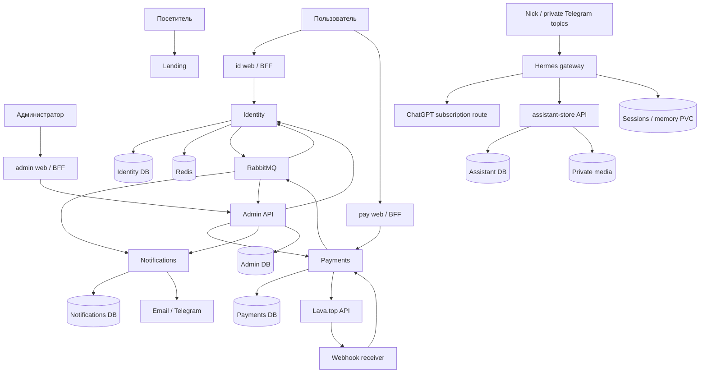

# Глава 3. Архитектура платформы и продуктовые границы

> Версия 0.3: детальные действия, зависимости и test cases находятся в [карточках задач](../../04-delivery/README.md). Эта глава задаёт предметный контекст.

## 3.1. Карта сервисов

| Компонент | Зачем нужен пользователю/владельцу | Собственные данные | Что не делает |
|---|---|---|---|
| Landing web | Представление Nick и контакт | Контент/переводы в Git | Не хранит аккаунты и деньги |
| Identity backend + id web | Один аккаунт, безопасный вход, устройства и доступы | Users, identities, sessions, credentials, roles, grant projection | Не считает оплаченные периоды самостоятельно |
| Notifications backend | Письма, Telegram, центр уведомлений и настройки | Preferences, inbox, delivery attempts, templates metadata | Не решает, была ли оплата успешна |
| Payments backend + pay web | Покупки, подписки, финансовая история и сверка | Catalog, orders, payments, subscriptions, grants, journals | Не выдаёт административные роли за покупку |
| Admin web + admin backend/BFF | Поддержка пользователей и управление операциями | Read projections, jobs, action log | Не редактирует чужие БД и не заменяет Argo/Grafana |
| Hermes + assistant-store | Личный помощник в Telegram topics, каталог вещей/объявлений | Свои sessions/memory; отдельная assistant DB и private media | Не обслуживает всех посетителей и не управляет кластером |
| Battleship, позже | Онлайн-матчи, боты, оплата, рейтинг | Будет определено отдельным ТЗ | Сейчас не реализуется |

Notifications UI в первом релизе — общий компонент inbox и раздел настроек внутри id web; отдельное notifications-web не требуется. Admin backend — небольшой агрегатор/координатор, который вызывает доменные API; это не «суперсервис» с доступом ко всем таблицам.

## 3.2. Поддомены и публичные маршруты

| Адрес | Назначение | Доступ |
|---|---|---|
| outegro.dev | EN-лендинг; /ru — RU | Публичный |
| id.outegro.dev | Вход, аккаунт, сессии, уведомления | Вход публичный; кабинет по сессии |
| pay.outegro.dev | Заказы, подписки, оплата | Личная история по сессии |
| admin.outegro.dev | Административная панель | Сильная аутентификация + RBAC |
| hooks.outegro.dev/lava | Webhook провайдера | Машинная аутентификация, не пользовательская cookie |
| battleship.outegro.dev | Будущая игра | Зарезервировано в плане, не пустой сайт |

API для браузера проходят через BFF соответствующего origin. Внутренние Nest API доступны по ClusterIP, кроме явно опубликованного webhook ingress. `api.outegro.dev` не обязателен без внешних клиентов. Для Argo/Grafana/RabbitMQ UI определить закрытый маршрут доступа, а не выставлять все панели публично «как удобнее».

## 3.3. Схема взаимодействия

Физически PostgreSQL одна, но логические БД и роли отдельные. Все контейнеры находятся на одном VPS. Внешние email/Lava/object storage не считаются дополнительными узлами K3s.

## 3.4. Согласованность

Внутри сервиса — транзакция PostgreSQL. Между сервисами — события at-least-once, версии агрегата, idempotent consumers и сверка. Никакой распределённой транзакции на весь кластер. Пользователь видит честное промежуточное состояние: «Оплата подтверждена, доступ активируется», если projection ещё не обновилась.

Identity владеет административными ролями. Payments владеет коммерческими grants и оплаченными периодами. Identity хранит их проекцию для быстрой проверки; локальные проекции приложений допустимы с ограничением свежести. При неизвестной свежести привилегированная операция проверяет владельца данных или отклоняется, а не автоматически разрешается.

## 3.5. Синхронные и асинхронные операции

HTTP: вход, чтение аккаунта, создание заказа, получение checkout URL, отмена подписки, административная команда. RabbitMQ: уведомление о завершённом изменении, обновление grants, read projections и audit-feed. WebSocket/SSE при необходимости — только пользовательские live-обновления, не замена транзакционной доставке событий. Inbox может стартовать с редкого polling; отдельная realtime-инфраструктура до игры не обязательна.

Каждый HTTP mutating endpoint имеет input schema, authentication/authorization, error code, requestId и ожидаемый idempotency contract. Клиент не передаёт доверенный userId/роль/сумму в качестве основания для операции. Service-to-service identity отдельна от пользовательской; один «общий бессрочный admin token» не используется.

## 3.6. Структура backend

Nest modules по доменным возможностям, а не одно огромное services.ts. Controller/consumer валидирует контракт и вызывает application use case; доменная логика не зависит от Prisma/Drizzle; persistence и Lava/email — адаптеры. Repository вводится там, где отделяет сложные SQL/транзакции, без обязательной абстракции над каждым SELECT.

Пример Payments: catalog, orders, checkout, provider-inbox, payments, subscriptions, entitlements, reconciliation, journal, admin-api. Identity: users, identities, login, sessions, passkeys, clients/SSO, access-control. События выпускаются из application transaction через outbox. Общие packages не содержат бизнес-таблицы сразу всех сервисов.

## 3.7. Совместимость и обновление

Снимок registry из исследования: Nest core 12.1.0, Drizzle ORM 0.45.3/Kit 0.31.11, Next 16.3.6, React 19.3.0, R3F 9.8.1 — кандидаты, не уже проверенная комбинация. Существующая RabbitMQ-обёртка заявляла peer для Nest 11; нельзя решить это только force/override. Spike проверяет подходящий adapter или собственную небольшую обёртку над AMQP-клиентом: confirms, ack/nack, retry, reconnect, shutdown.

Nest 12 требует учёта обновлённого runtime и lifecycle; собственный тотальный перевод monorepo на ESM не принимается как обязательное условие без необходимости. Node 24 LTS с подходящей patch-версией — стартовый кандидат. Сохранить Biome/Vitest, если совместимы. Источник: [Nest migration guide](https://docs.nestjs.com/migration-guide); точная матрица хранится в lockfile и ADR.

## 3.8. Сборка и границы изменений

Разработка лендинга заканчивается работающим preview на будущих UI-контрактах. После него обновляется backend/infrastructure. Контракты и fixtures позволяют интегрировать интерфейсы до появления провайдера. Финальное объединение не означает копирование нескольких независимых дизайн-систем: общий package создаётся уже в главе 2. Версии образов привязаны к commit/digest, миграции — к release; изменения секретов и DNS проходят отдельные runbooks.
