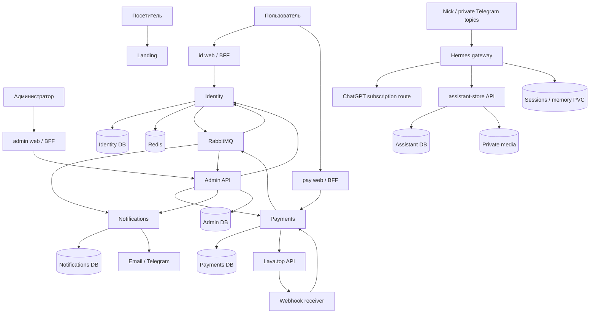

# Nick Lukashik · outegro.dev

Спецификация v0.3. Для исполнения использовать task cards; этот файл — цельное чтение предметных глав.

---

# Глава 0. Паспорт проекта и принятые решения

> Версия 0.3: детальные действия, зависимости и test cases находятся в [карточках задач](../04-delivery/README.md). Эта глава задаёт предметный контекст.

Версия 0.3 · 27 сентября 2026 года · владелец: Nick Lukashik.

Это проектная спецификация и план реализации. «Решено» означает прямое указание владельца; «предлагается» — архитектурное решение для проверки при реализации; «открыто» — вопрос без ответа. Описанная целевая функциональность ещё не реализована. Код и настройки действующего production в рамках подготовки документа не менялись.

## 0.1. Цель

Создать личное портфолио senior/full-stack JavaScript разработчика на `outegro.dev` и собственную платформу приложений с общей идентификацией, уведомлениями, оплатами, подписками и административной панелью. Портфолио должно помогать получать B2B-контракты и предложения работы. Экспертность показывается понятным рассказом о компетенциях и качеством самого сайта; готовые кейсы появятся позже.

## 0.2. Решения владельца

| ID | Решение | Следствие |
|---|---|---|
| D-01 | Публичное имя Nick Lukashik | Это имя в hero, метаданных и контактах |
| D-02 | Первый домен outegro.dev | Старое обсуждение autegra.dev больше не актуально |
| D-03 | Именной домен возможен позже | Identity и приложения не зависят от домена портфолио |
| D-04 | «Жидкая подпись», серебро, liquid glass | Единая материальная и анимационная система |
| D-05 | React Three Fiber, качественная пластичная анимация | Сначала измеряемый прототип сцены, затем интеграция |
| D-06 | Английский по умолчанию, русский доступен | Общая i18n-политика для всех фронтов и уведомлений |
| D-07 | Лендинг → инфраструктура/сервисы → интеграция → K3s production | Публикация ждёт готовности платформы; игра не входит в этот релиз |
| D-08 | Один VPS: 4 vCPU / 8 ГБ / 200 ГБ SSD | Только вертикальный рост; single-node K3s |
| D-09 | Новые базы и новые пользователи | Миграция данных и старых passkeys не требуется |
| D-10 | Текущий outegro.com не упоминать публично | Использовать код как внутреннюю основу, не как готовый кейс |
| D-11 | Projects пока заглушка | Без фиктивных кейсов, отзывов, метрик и кнопок несуществующего демо |
| D-12 | Battleship после production | Сейчас только онлайн, боты, оплата и рейтинг; без подробного ТЗ |
| D-13 | «Анонимно» было ошибкой диктовки | Удалено как требование; гостевой доступ к игре пока не решён |
| D-14 | Lava.top — выбранный провайдер | Используются developers.lava.top и gate.lava.top, не lava.ru |
| D-15 | Подписки, роли, админка нужны | Включены в продуктовую и техническую модель |
| D-16 | Hermes в этом K3s до игры | Личный Telegram bot, темы с разными контекстами/правилами |
| D-17 | ChatGPT Plus; только лимиты подписки | OAuth Codex, no paid fallback, проверка credits |
| D-18 | Каталог вещей по фото | Структурированная БД, private media, черновики объявлений |

## 0.3. Профессиональная основа контента

По предоставленным владельцем Memories: более 6 лет в JavaScript; senior/full-stack; TypeScript, React, Next.js, NestJS, Node.js, Tailwind, PostgreSQL, Docker, Kubernetes, Redis, RabbitMQ, ClickHouse; опыт e-commerce, Core Web Vitals, SEO и внутренних административных систем; интерес к B2B-контрактам, AI-инструментам и инфраструктуре. Эти сведения получены от владельца, а не независимо проверены.

Для первой версии достаточно имени, роли, компетенций, короткого подхода к работе и контакта. Географию Tbilisi можно использовать позже. Сведения о здоровье, питании, документах и личных привычках не нужны для задачи сайта и не включаются в публичный контент. Не раскрывать работодателей, цифры результатов и клиентские материалы без соответствующих данных.

## 0.4. Что означает первый production-релиз

Готовый EN/RU-лендинг + единая дизайн-система + работающие identity, notifications, payments/subscriptions + минимальная операционная админка + Hermes/Telegram topics/каталог вещей + базы/очереди/наблюдаемость + воспроизводимое развёртывание и восстановление на одном VPS. Публичный посетитель видит портфолио; технические сервисы поддерживают аккаунт и будущие приложения. Каталог реальных платных товаров может оставаться закрытым до появления продукта.

Под «готовыми платежами» различаются три состояния: реализована доменная логика и контрактные тесты; пройдены проверки с реальным провайдером в поддерживаемом им тестовом сценарии; включены продажи конкретного товара. Только первое состояние не даёт права заявлять, что реальные платежи проверены. Если Lava не предоставляет подходящий sandbox, проверка малой реальной транзакцией планируется отдельно после готовности merchant-аккаунта и согласования владельцем расходов.

## 0.5. Приоритеты

- P0 — необходимо до первого совместного production: лендинг, DS, EN/RU, новая persistence, identity и SSO, роли, уведомления, ядро оплаты/подписок, минимальная админка, Hermes и каталог, GitOps, наблюдаемость, backup/restore, интеграционные проверки.
- P1 — после первого production: расширенная операционная админка, автоматизация спорных финансовых операций, улучшения аналитики, отдельное ТЗ Battleship.
- P2 — продуктовые расширения: дополнительные приложения, сложные тарифы, промокоды собственного движка, организации/команды, CMS. Это кандидаты, а не обещанный scope.

Решение о внутреннем кошельке пока открыто. Базовый план включает прямые оплаты, подписки и журнал финансовых операций. Кошелёк проработан отдельно и не объявляется работающим балансом до явного выбора.

## 0.6. Границы и правила

Существующий VPS используется только как источник знаний о текущей конфигурации. Он не становится вторым узлом новой платформы. CI не собирает образы на новом production-сервере. Базы других сервисов не читаются напрямую. Публичные URL админских инструментов не считаются защитой. Админка выполняет команды доменных API, а не произвольный SQL. Конкретные версии фиксируются после проверки совместимости, а не по одному признаку latest.

## 0.7. Как работать с документом

Главы 1–2 описывают лендинг и дизайн-систему. Главы 3–10 — сервисы и платформу. Глава 11 — личный Hermes с Telegram topics и каталогом вещей. Глава 12 — объединение и первый production. Глава 13 оставляет место будущим приложениям. Глава 14 содержит атомарный backlog и зависимости. Глава 15 — вопросы, критерии приёмки и источники.

Каждая задача должна иметь один проверяемый результат, зависимости, тест/свидетельство готовности и способ отменить изменение. Задача «сделать весь auth» не атомарна; «добавить отзыв одной сессии и проверить следующий запрос» атомарна.

---

# Глава 1. Лендинг Nick Lukashik

> Версия 0.3: детальные действия, зависимости и test cases находятся в [карточках задач](../04-delivery/README.md). Эта глава задаёт предметный контекст.

## 1.1. Идея и впечатление

Персональный сайт инженера, который работает и с интерфейсом, и с серверной частью, и с эксплуатацией. Визуальная подпись — пластичный серебряный объект, напоминающий монограмму NL или абстрактную ленту. Имя остаётся обычным читаемым текстом. Посетитель должен быстро понять специализацию и увидеть способ связаться.

Главная не превращается в демонстрацию Kubernetes или панель сервисов. Техническая глубина раскрывается в описании компетенций, а служебные приложения доступны через сдержанную навигацию. Упоминания текущего outegro.com и неподготовленные кейсы исключены.

## 1.2. Структура страницы

| Блок | Содержание первой версии | Поведение |
|---|---|---|
| Header | Имя/знак, Expertise, Approach, Projects, Contact, EN/RU | Понятная навигация, доступна клавиатурой |
| Hero | Nick Lukashik; Senior Full-stack JavaScript Developer; короткая специализация | Серебряная сцена рядом с текстом, основной CTA Contact |
| Expertise | Frontend; Backend & Data; Infrastructure; AI-assisted workflow | Группы компетенций с коротким объяснением, без процентов владения |
| Approach | Как проектируется, проверяется и доводится до production работа | 3–4 конкретных принципа, без вымышленных результатов |
| Projects | Аккуратное состояние «Projects are in progress» | Не выдавать планы за готовый продукт; место для будущего Battleship |
| Contact | Подтверждённый email и реальные профильные ссылки | Без неработающих кнопок; до получения контакта — placeholder только в preview |
| Footer | Имя, год, языки, необходимые документы | Ссылки на аккаунт и billing — только после интеграции |

Короткий черновик EN: “I build web interfaces, backend services, and the infrastructure that runs them.” RU: «Создаю веб-интерфейсы, серверные сервисы и инфраструктуру для их работы». Это редактируемый текст для макета, не финальный рекламный слоган.

## 1.3. Как показать экспертность без готовых проектов

Frontend: TypeScript, React, Next.js; внимание к производительности, SEO, доступности и интерфейсам. Backend: Node.js/NestJS, PostgreSQL, очереди, Redis, авторизация и интеграции. Delivery: Docker, Kubernetes, CI/CD, метрики и восстановление. AI: помощь в исследовании, разработке и проверке; ответственность за результат остаётся у разработчика.

Технологии группируются по задачам, а не в бесконечную бегущую строку логотипов. ClickHouse остаётся в перечне опыта, но не становится обязательной базой новой платформы. Проект поиска вакансий из Memories пока не публикуется как кейс. Не показывать недоказанные uptime, число клиентов, доход, места работы или достижения.

## 1.4. Эффекты и анимация

Hero: медленное изменение формы серебряной подписи; отражение мягкого окружения; небольшая реакция на pointer; короткое появление без блокирующего загрузчика. Целевая форма должна сохранять идентичность, а не выглядеть случайным blob. Для touch — самостоятельная спокойная анимация без обязательного hover.

Liquid glass: навигация, небольшая плавающая панель или отдельный слой акцента. Текст, таблицы, формы входа и финансовые данные используют контрастную устойчивую поверхность. Серебро — материал акцента; стекло не накладывается одновременно на все секции. Переходы между секциями умеренные, без перехвата нативного скролла.

React Three Fiber отвечает за WebGL-сцену. CSS/Motion отвечает за DOM. Одна система управляет конкретным свойством элемента. Pointer-позиции и деформация обновляются внутри render loop через refs, без React setState на каждый кадр. Постоянная анимация рендерится только пока сцена видима; demand rendering подходит для состояния покоя, а не автоматически заменяет активный loop. [R3F performance](https://r3f.docs.pmnd.rs/advanced/scaling-performance), [pitfalls](https://r3f.docs.pmnd.rs/advanced/pitfalls).

## 1.5. Цели качества 3D

60 FPS означает бюджет около 16,7 мс на кадр; 120 FPS — около 8,3 мс. Это цели на согласованной матрице устройств, а не обещание для любого браузера. Экран 60 Гц не покажет 120 отдельных кадров. Производительность GPU в браузере не увеличивается от покупки более мощного VPS.

| Профиль | Проектный старт | Когда применяется |
|---|---|---|
| High | DPR до 2, качественные отражения, умеренное сглаживание | Достаточная GPU-производительность и разрешение |
| Balanced | DPR около 1–1,5, проще отражения/геометрия | Ноутбуки и большинство телефонов после измерений |
| Low | DPR около 1, минимум постобработки, проще материал | Перегрев, low power, устойчивые пропуски кадров |
| Static | Подготовленный постер с корректным размером | Reduced motion, нет WebGL, ошибка контекста, отказ от анимации |

DPR и число пикселей ограничиваются вместе: большой 4K viewport с DPR 2 не должен безусловно создавать гигантский render target. Разрешение сцены адаптируется отдельно от резкости DOM-текста. Понижение качества происходит с гистерезисом, чтобы настройки не прыгали каждую секунду. Смена качества не должна менять геометрию страницы.

Методика: фиксируем модель устройства, ОС, браузер, viewport, DPR, частоту дисплея, режим питания и профиль. После прогрева 10 секунд измеряем 60 секунд idle/pointer/scroll, затем повторяем 5 минут для нагрева. Записываем median/p95 frame time, долю кадров >33 мс, длительные остановки, память и выбранный профиль. GPU timing используем только при доступной поддержке; rAF-интервалы не выдаём за точное время GPU.

Предлагаемый критерий для целевого 60-Гц устройства: median около 16,7 мс или лучше, не менее 95% кадров в пределах 20 мс в активной сцене, менее 1% кадров >33 мс после прогрева. Если не проходит, сначала упрощается эффект, а не скрывается результат усреднением. Для 120 Гц отдельный stretch-тест; он не блокирует основной релиз. Реальные пороги утверждаются после scene prototype.

## 1.6. Загрузка и доступность

SSR отдаёт имя, смысл, навигацию и контакты до загрузки сцены. R3F/Three.js загружаются отдельным client chunk; постер резервирует место. Нет полноэкранного loading gate. При потере WebGL-контекста текст и CTA продолжают работать. Сцена декоративна для screen reader; её пауза имеет доступное имя. prefers-reduced-motion соблюдается при первом рендере, а не после заметного движения.

Целевые LCP ≤2,5 с, INP ≤200 мс, CLS ≤0,1 — ориентиры приёмки на согласованном профиле, не уже измеренные показатели. До появления полевых данных проверяются лабораторные сценарии; TBT не объявляется эквивалентом INP. Вводный бюджет: critical JS без 3D до 200 KiB gzip, сцена с моделями/окружением до 2 MiB передачи как стартовый ориентир. Превышение требует профилирования и явного решения.

## 1.7. EN/RU и URL

В существующем коде i18n реализована неодинаково: landing использует next-intl и cookie, сервисные фронты — словари; client locale helper выбирает русский по navigator, а User.locale в Prisma имеет default ru. Для нового проекта это нужно согласовать, а не просто скопировать.

Предлагается для публичного лендинга: `/` — EN, `/ru` — RU; одинаковые секции и переведённые metadata; явный URL приоритетен. Первое посещение `/` остаётся английским независимо от Accept-Language. Переключатель ведёт на соответствующий локализованный URL, сохраняя секцию. В сервисных приложениях: выбранный пользователем язык/профиль, затем EN; автоопределение русского по устройству выключено. User.locale в новой БД — en.

next-intl поддерживает defaultLocale, as-needed prefix и отключение автоматического определения. Конкретный routing фиксируется при реализации. [Документация](https://next-intl.dev/docs/routing/configuration).

Cookie языка допустимо разделять между поддоменами как несекретное предпочтение, но язык не является авторизацией. При будущем именном домене передаётся явный locale hint через allowlisted SSO flow или выбор пользователя; общий cookie между разными доменами не предполагается. UTC в хранении событий, locale/timezone только для отображения; валюта покупки не меняется от переключения языка.

## 1.8. SEO и публикация

EN/RU canonical/hreflang, осмысленные title/description, Open Graph, favicon, sitemap, robots. Реальные профильные ссылки — в Person structured data только после получения. Preview и служебные фронты закрыты от индексации; robots/noindex не заменяет авторизацию. Пустой Projects остаётся частью главной, отдельные пустые кейсы не создаются. Форма контакта необязательна: первая версия может использовать mailto и подтверждённые профили.

## 1.9. Артефакты главы и приёмка

Результаты: карта секций; EN/RU-словарь; desktop/mobile-макеты; прототип серебряной сцены; performance-отчёт; реализованный landing в preview. Обязательны проверки 360/390/768/1440 px, клавиатуры, reduced motion, отсутствующего WebGL, длинных RU-строк, ошибок загрузки и прямых входов на `/ru`. На этом этапе production ещё не публикуется: глава 12 объединит лендинг с готовой платформой.

---

# Глава 2. Общая дизайн-система

> Версия 0.3: детальные действия, зависимости и test cases находятся в [карточках задач](../04-delivery/README.md). Эта глава задаёт предметный контекст.

## 2.1. Назначение

Один визуальный и поведенческий фундамент для landing, id, pay, notifications UI, admin и будущего Battleship. Публичная главная выразительна; сервисные экраны спокойнее и плотнее. Общность создают типографика, пропорции, состояния, материалы и навигационные паттерны, а не обязательный WebGL на каждой странице.

## 2.2. Принципы «жидкой подписи»

Основной образ: полированное серебро на графитовом или светлом нейтральном фоне. Отражения крупные и чистые, без радужного шума. Стекло тонкое, с аккуратным бликом по краю. Пластичность ощущается в материале и реакции на движение, но текст не деформируется вместе с объектом.

Предлагается тёмная выразительная главная и светлая/нейтральная рабочая поверхность приложений на тех же semantic tokens. Это одна DS с разными surface presets; полноценный пользовательский light/dark switch не обязателен для первого релиза. После макетов можно выбрать единую тёмную основу, если контраст таблиц и форм останется достаточным.

## 2.3. Слои токенов

| Слой | Примеры | Правило |
|---|---|---|
| Primitive | neutral-0…950, silver ramps, spacing, durations | Не использовать напрямую в продуктовых компонентах без необходимости |
| Semantic | background, surface, text-primary, border, focus, danger | Значение одинаково во всех приложениях |
| Material | glass-opacity, blur, edge, reflection intensity | Есть opaque fallback |
| Component | button-height, input-radius, table-row-height | Компоненты не копируют локальные значения |
| Motion | enter, exit, hover, easing, reduced | Время и easing согласованы |
| 3D quality | DPR cap, render pixel cap, geometry tier | Не смешивать с CSS-токенами темы |

Стартовые предложения для макетов: graphite #101215; text #F5F6F7 на тёмном; light surface #F5F6F8; dark text #17191D; silver #B8BEC6/#E9EDF2. Итоговые пары подтверждаются контрастом, а не названием цвета. Ошибка/успех/предупреждение имеют и цвет, и текст/иконку. Фокус хорошо заметен на серебре и стекле.

## 2.4. Типографика и композиция

Один основной гротеск с качественной кириллицей и variable weights, один моноширинный для IDs/технических значений по необходимости. Финальный шрифт выбирается на макетах с проверкой лицензии. Self-hosted subset, корректный fallback и минимальный layout shift. Hero-scale адаптивный, формы и таблицы не уменьшаются ради декоративного воздуха.

Сетка и spacing основаны на кратности 4 px; контейнер и поля адаптируются; длинные значения в админке имеют копирование и перенос/обрезку с доступным полным значением. Радиусы ограничены несколькими размерами. Мягкость hero не требует круглых финансовых таблиц.

## 2.5. Библиотека компонентов

| Семейство | Компоненты P0 | Обязательные состояния |
|---|---|---|
| Основы | Button, Link, IconButton, Text, Heading, Separator | Hover, focus, active, disabled |
| Формы | Input, CodeInput, Select, Checkbox, Switch, FormField | Empty, invalid, read-only, pending, error |
| Обратная связь | Alert, Toast, InlineError, Spinner, Skeleton | Доступное объявление, retry, timeout |
| Наложения | Dialog, ConfirmDialog, Popover, Tooltip, Menu | Focus trap, Escape, возврат фокуса |
| Навигация | Header, ServiceNav, Tabs, Breadcrumbs, LocaleSwitch | Active, keyboard, mobile |
| Данные | Table, Pagination, FilterBar, SortHeader, EmptyState | Loading, empty, partial, stale, forbidden |
| Identity | LoginMethod, SessionItem, PasskeyItem | Current/revoked/unavailable |
| Billing | Amount, PaymentStatus, SubscriptionSummary, ReceiptRow | Валюта, precision, pending, refund |
| Operations | Timeline, EventStatus, Diff, ReconciliationIssue | Failed, duplicate, unmatched, resolved |

Составные компоненты знают формат отображения, но не хранят бизнес-логику оплаты или ролей. Например, PaymentStatus получает typed state; решения о доступе остаются на backend. API-запросы не зашиваются в базовый Button или Table.

## 2.6. Паттерны экранов

Landing: выразительный hero + секции. Identity: короткая последовательность действий и ясное восстановление после ошибки. Payments: товар, сумма, валюта, период, подтверждённое состояние; декоративные эффекты не отвлекают от цены. Admin: таблица → карточка → действие → audit result. Battleship позже наследует typography/buttons/statuses, но игровое поле получает собственные компоненты.

Все фронты имеют согласованные page title, account menu, locale, error boundary, not-found, maintenance и support/contact route. ServiceSwitcher показывает только реально запущенные сервисы, учитывает права и не раскрывает админку обычному пользователю; backend всё равно независимо проверяет доступ.

## 2.7. Реализация в monorepo

Предлагаемые packages: `design-tokens`, `ui`, `i18n`, `brand-scene`, `contracts`, `auth-client` и общие конфиги. Использовать существующий `packages/ui` как основу, выделяя токены без бесцельного переименования. `brand-scene` не импортируется в ui root, чтобы формы не получали Three.js автоматически. Server/client entrypoints разделены. Схемы API и UI-локализация не образуют циклических зависимостей.

Component gallery/Storybook разворачивается локально или в защищённом preview; отдельный постоянно работающий production-pod для неё не нужен. В галерее — EN/RU, mobile, длинные значения, disabled/error/loading, keyboard. Визуальные regression-снимки делаются для значимых экранов и состояний, а не для каждой технической функции.

## 2.8. Liquid glass: варианты реализации

Базовый UI-материал — CSS backdrop blur, прозрачность, граница, highlight и надёжная подложка. Для фирменной сцены — R3F/Three.js shader/material. `liquid-glass-js` рассматривается как эксперимент, а не как обязательная основа форм: WebGL2/html2canvas требуют измерения, React-интеграция и доступность проверяются отдельно. `liquid-logo` — референс металлического материала. Shadergradient — необязательный кандидат для мягкого фона; не добавлять второй WebGL canvas без пользы и замеров.

## 2.9. Definition of Done

Токены документированы; основные компоненты имеют типизированные props и состояния; EN/RU не ломают размеры; keyboard/focus/reduced motion работают; светлая/тёмная поверхность не теряет контраст; bundle приложения без сцены не содержит её тяжёлые зависимости; минимум один экран id и один pay собраны из DS до завершения лендинга. Любое изменение shared tokens проверяется на landing, id, pay и admin.

---

# Глава 3. Архитектура платформы и продуктовые границы

> Версия 0.3: детальные действия, зависимости и test cases находятся в [карточках задач](../04-delivery/README.md). Эта глава задаёт предметный контекст.

## 3.1. Карта сервисов

| Компонент | Зачем нужен пользователю/владельцу | Собственные данные | Что не делает |
|---|---|---|---|
| Landing web | Представление Nick и контакт | Контент/переводы в Git | Не хранит аккаунты и деньги |
| Identity backend + id web | Один аккаунт, безопасный вход, устройства и доступы | Users, identities, sessions, credentials, roles, grant projection | Не считает оплаченные периоды самостоятельно |
| Notifications backend | Письма, Telegram, центр уведомлений и настройки | Preferences, inbox, delivery attempts, templates metadata | Не решает, была ли оплата успешна |
| Payments backend + pay web | Покупки, подписки, финансовая история и сверка | Catalog, orders, payments, subscriptions, grants, journals | Не выдаёт административные роли за покупку |
| Admin web + admin backend/BFF | Поддержка пользователей и управление операциями | Read projections, jobs, action log | Не редактирует чужие БД и не заменяет Argo/Grafana |
| Hermes + assistant-store | Личный помощник в Telegram topics, каталог вещей/объявлений | Свои sessions/memory; отдельная assistant DB и private media | Не обслуживает всех посетителей и не управляет кластером |
| Battleship, позже | Онлайн-матчи, боты, оплата, рейтинг | Будет определено отдельным ТЗ | Сейчас не реализуется |

Notifications UI в первом релизе — общий компонент inbox и раздел настроек внутри id web; отдельное notifications-web не требуется. Admin backend — небольшой агрегатор/координатор, который вызывает доменные API; это не «суперсервис» с доступом ко всем таблицам.

## 3.2. Поддомены и публичные маршруты

| Адрес | Назначение | Доступ |
|---|---|---|
| outegro.dev | EN-лендинг; /ru — RU | Публичный |
| id.outegro.dev | Вход, аккаунт, сессии, уведомления | Вход публичный; кабинет по сессии |
| pay.outegro.dev | Заказы, подписки, оплата | Личная история по сессии |
| admin.outegro.dev | Административная панель | Сильная аутентификация + RBAC |
| hooks.outegro.dev/lava | Webhook провайдера | Машинная аутентификация, не пользовательская cookie |
| battleship.outegro.dev | Будущая игра | Зарезервировано в плане, не пустой сайт |

API для браузера проходят через BFF соответствующего origin. Внутренние Nest API доступны по ClusterIP, кроме явно опубликованного webhook ingress. `api.outegro.dev` не обязателен без внешних клиентов. Для Argo/Grafana/RabbitMQ UI определить закрытый маршрут доступа, а не выставлять все панели публично «как удобнее».

## 3.3. Схема взаимодействия

Физически PostgreSQL одна, но логические БД и роли отдельные. Все контейнеры находятся на одном VPS. Внешние email/Lava/object storage не считаются дополнительными узлами K3s.

## 3.4. Согласованность

Внутри сервиса — транзакция PostgreSQL. Между сервисами — события at-least-once, версии агрегата, idempotent consumers и сверка. Никакой распределённой транзакции на весь кластер. Пользователь видит честное промежуточное состояние: «Оплата подтверждена, доступ активируется», если projection ещё не обновилась.

Identity владеет административными ролями. Payments владеет коммерческими grants и оплаченными периодами. Identity хранит их проекцию для быстрой проверки; локальные проекции приложений допустимы с ограничением свежести. При неизвестной свежести привилегированная операция проверяет владельца данных или отклоняется, а не автоматически разрешается.

## 3.5. Синхронные и асинхронные операции

HTTP: вход, чтение аккаунта, создание заказа, получение checkout URL, отмена подписки, административная команда. RabbitMQ: уведомление о завершённом изменении, обновление grants, read projections и audit-feed. WebSocket/SSE при необходимости — только пользовательские live-обновления, не замена транзакционной доставке событий. Inbox может стартовать с редкого polling; отдельная realtime-инфраструктура до игры не обязательна.

Каждый HTTP mutating endpoint имеет input schema, authentication/authorization, error code, requestId и ожидаемый idempotency contract. Клиент не передаёт доверенный userId/роль/сумму в качестве основания для операции. Service-to-service identity отдельна от пользовательской; один «общий бессрочный admin token» не используется.

## 3.6. Структура backend

Nest modules по доменным возможностям, а не одно огромное services.ts. Controller/consumer валидирует контракт и вызывает application use case; доменная логика не зависит от Prisma/Drizzle; persistence и Lava/email — адаптеры. Repository вводится там, где отделяет сложные SQL/транзакции, без обязательной абстракции над каждым SELECT.

Пример Payments: catalog, orders, checkout, provider-inbox, payments, subscriptions, entitlements, reconciliation, journal, admin-api. Identity: users, identities, login, sessions, passkeys, clients/SSO, access-control. События выпускаются из application transaction через outbox. Общие packages не содержат бизнес-таблицы сразу всех сервисов.

## 3.7. Совместимость и обновление

Снимок registry из исследования: Nest core 12.1.0, Drizzle ORM 0.45.3/Kit 0.31.11, Next 16.3.6, React 19.3.0, R3F 9.8.1 — кандидаты, не уже проверенная комбинация. Существующая RabbitMQ-обёртка заявляла peer для Nest 11; нельзя решить это только force/override. Spike проверяет подходящий adapter или собственную небольшую обёртку над AMQP-клиентом: confirms, ack/nack, retry, reconnect, shutdown.

Nest 12 требует учёта обновлённого runtime и lifecycle; собственный тотальный перевод monorepo на ESM не принимается как обязательное условие без необходимости. Node 24 LTS с подходящей patch-версией — стартовый кандидат. Сохранить Biome/Vitest, если совместимы. Источник: [Nest migration guide](https://docs.nestjs.com/migration-guide); точная матрица хранится в lockfile и ADR.

## 3.8. Сборка и границы изменений

Разработка лендинга заканчивается работающим preview на будущих UI-контрактах. После него обновляется backend/infrastructure. Контракты и fixtures позволяют интегрировать интерфейсы до появления провайдера. Финальное объединение не означает копирование нескольких независимых дизайн-систем: общий package создаётся уже в главе 2. Версии образов привязаны к commit/digest, миграции — к release; изменения секретов и DNS проходят отдельные runbooks.

---

# Глава 4. Identity, роли и права доступа

> Версия 0.3: детальные действия, зависимости и test cases находятся в [карточках задач](../04-delivery/README.md). Эта глава задаёт предметный контекст.

## 4.1. Что уже реализовано в основе

Найдены email-коды, Google identity, Telegram linking, passkeys, session metadata, Redis refresh-token hash, ES256 JWT/JWKS, Entitlement и transactional outbox. `Entitlement` содержит userId/service/role/source/expiresAt и unique(userId, service, role); роли формируются при выпуске токена. Это полезная основа, но не полноценный RBAC с permissions, audit, управлением grant lifecycle и подписками. В исследованных auth/contracts не найдены отдельные Role/Permission/RoleBinding и полноценный административный permission guard.

Важно: комментарий «roles authoritative» не доказывает актуальность проверки на каждом запросе. В разных сервисах обнаружены разные правила проверки JWT и сессии. Текущий `roles: string[]` смешивает техническую роль и платный уровень. В новой модели это разделяется.

## 4.2. Продуктовые возможности пользователя

| Возможность | Сценарий и результат | Первая версия |
|---|---|---|
| Вход по email | Код, срок, повторная отправка и понятная ошибка | Да |
| Google | Вход и привязка к существующему аккаунту после проверки | Да, при настроенном OAuth client |
| Passkey | Создание, вход, имя устройства, удаление с защитой от потери доступа | Да |
| Telegram | Подключение канала уведомлений через одноразовую связь | Да, не объявлять самостоятельным login без реализации |
| Профиль | Имя отображения, язык EN/RU, контакт | Да, минимум полей |
| Сессии | Список устройств, текущая сессия, завершить одну/другие/все | Да |
| Способы входа | Видеть привязки, безопасно добавлять/удалять | Да |
| Мои доступы | Продукты и срок доступа с источником | Да, read model из Payments |
| Настройки уведомлений | Каналы и необязательные темы | Да |
| Закрытие аккаунта | Запрос, статус, обработка с сохранением необходимых финансовых записей | Базовый процесс; автоматизация позже |

Удаление последнего способа входа запрещено без другого проверенного способа. Email change требует подтверждения нового адреса и защиты от захвата; если не помещается в P0, UI сообщает о ручном процессе, а не меняет anchor email напрямую. Финансовые записи связаны стабильным userId, не текущим email.

## 4.3. Межприложенческий вход

id.outegro.dev — центральный issuer и login UI. Каждое приложение имеет зарегистрированный clientId и точный список redirect URI. Приложение перенаправляет на id; после входа получает короткоживущий одноразовый code; BFF меняет его server-to-server и ставит host-only HttpOnly Secure cookie. State и PKCE привязаны к инициировавшей сессии, code — к client и redirect URI; повторный обмен запрещён.

Выбор protocol library/OIDC-compatible решения — отдельный spike. Нельзя называть собственный flow полноценным OIDC, пока не реализованы и проверены требуемые протоколом механизмы. UserInfo/discovery/logout нужны только в составе выбранного контракта, не как декоративные URL.

Предлагается passkey RP ID `id.outegro.dev` и разрешённый origin этого сервиса. Все приложения перенаправляют туда; будущая смена домена лендинга не меняет RP. Новые пользователи начинают с чистой БД; перенос credentials с outegro.com не нужен. Решение о RP фиксируется до первой регистрации passkeys.

## 4.4. Сессии и refresh

Проверить и переработать сценарий гонки: две вкладки/приложения могут одновременно отправить старый refresh; текущая Lua-логика считает несовпадение reuse и удаляет сессию. Это риск по коду, не подтверждённый production-инцидент.

Целевое поведение: короткая access TTL; refresh на BFF; single-flight для одной сессии в процессе; согласованный механизм конкуренции между процессами/репликами; ограниченная повторяемость результата ротации для легитимного retry; настоящее повторное использование за пределами принятого окна отзывает семейство токенов. Конкретное окно не расширять без угрозовой модели. Потерянный HTTP-ответ после успешной ротации — обязательный тест.

Logout current/all, блокировка пользователя и роль admin должны влиять на последующие чувствительные запросы. Для обычного read допустима ограниченная TTL-проекция; для изменения ролей, возвратов, подписок и wallet-команд проверка свежая. Браузерная видимость кнопки не является проверкой доступа.

## 4.5. Три независимых вида доступа

1. Platform role: owner, support, billing_operator, auditor, service_operator. Это административная ответственность.
2. Product entitlement: право `service/feature` с источником и сроком. Появляется от оплаты, подписки или контролируемого ручного grant.
3. Resource permission: доступ к своему заказу/профилю/матчу. Проверяется ownership по userId, даже если пользователь вошёл.

Подписка «pro» никогда не даёт admin. Наличие owner не делает финансовое изменение незаметным: audit обязателен. Service account получает ограниченные machine permissions и не становится человеком-owner.

## 4.6. Модель ролей

| Сущность | Основные поля | Инвариант |
|---|---|---|
| Role | id, key, description, system | Системные ключи стабильны |
| Permission | key, service, action, sensitivity | Явный allow; всё неизвестное deny |
| RolePermission | roleId, permissionKey | Unique pair |
| RoleBinding | userId, roleId, scope, expiresAt, grantedBy, reason | Изменения аудитируются |
| AccessVersion | userId, version, changedAt | Помогает инвалидировать cache/claims |
| CommercialGrantProjection | grantId, sourceId, service, feature, validFrom/Until, state, version | Не подменяет авторитетные данные Payments |

Первоначально роли и permissions задаются версионируемым seed; создание произвольных ролей через UI — P1. Owner bootstrap по заранее выбранному verified userId; не «первый зарегистрированный становится админом». Нельзя снять последнего активного owner без процедуры восстановления.

Предлагаемые permissions: users.read, users.suspend, sessions.revoke, roles.read, roles.assign, billing.read, subscriptions.cancel, refunds.request, reconciliation.run, events.replay, notifications.read, notifications.retry, services.read, flags.write, audit.read. Действия с PII отдельно от общих операционных метрик.

## 4.7. Коммерческие grants

Один feature может иметь несколько оснований: подписка, разовая покупка, ручная компенсация. Поэтому unique(userId, service, role) из старой схемы недостаточно. Новый grant идентифицируется по source type + sourceId + feature; эффективный доступ получается из действующих grants. Отмена одного источника не удаляет право, которое даёт другой.

Payments выпускает grant.changed с монотонной версией; Identity обновляет projection и accessVersion. Просрочка проверяется по UTC времени на запросе, а не только фоновой cron-задачей. Повторное событие не продлевает срок повторно; поздняя старая версия не восстанавливает отозванный доступ.

## 4.8. Безопасность и эксплуатация

ES256 keys с kid и перекрытием старого/нового JWKS до истечения старых токенов. Строгое iss/aud; отделить machine и user tokens. Redirect allowlist без wildcard; cookie/CSRF/Origin policy на изменяющих запросах; headers IP доверять только своему ingress/proxy. Email-code rate limiting по нескольким признакам, без раскрытия существования аккаунта. Логи не содержат коды, refresh, Authorization или полный cookie.

Admin требует свежую сильную аутентификацию: passkey с user verification и step-up для чувствительных действий либо выбранный дополнительный фактор. Recovery описывается отдельно; email-only fallback не должен незаметно обходить admin assurance policy. При недоступности свежей проверки критичные команды закрываются.

## 4.9. Приёмка

Позитивные и негативные тесты входа; повторный/истёкший код; account linking; cross-client code; неверный state/PKCE; две вкладки refresh; потерянный ответ; текущий и глобальный logout; заблокированный пользователь; stale role token; запрет чужого order/profile; passkey removal; key rotation; последний owner; восстановление owner; EN по умолчанию; RU на всех ошибках. Каждый отказ имеет понятный UX, requestId и запись с допустимым уровнем данных.

---

# Глава 5. Notifications: пользовательские уведомления

> Версия 0.3: детальные действия, зависимости и test cases находятся в [карточках задач](../04-delivery/README.md). Эта глава задаёт предметный контекст.

## 5.1. Продуктовое назначение

Пользователь получает нужное сообщение в выбранном канале и может найти его в центре уведомлений. Владелец видит, было ли сообщение сформировано, отправлено провайдеру, повторено или остановлено ошибкой. Сервис не определяет факт оплаты или права — он сообщает об изменениях, которыми владеют другие сервисы.

## 5.2. Каналы и категории

| Категория | Пример | Канал и настройка |
|---|---|---|
| Authentication | Код входа | Email; отдельный приоритет и TTL |
| Security | Новый способ входа, завершение сессий, изменение критичных данных | Email/inbox; не смешивать с маркетингом |
| Billing | Подтверждённая покупка, проблема продления, отмена, возврат | Inbox + email по продуктовой политике |
| Service | Изменение доступа, важное состояние приложения | Inbox, опционально email/Telegram |
| Product, позже | События Battleship | Только после отдельного ТЗ |
| Marketing | Новости и предложения | Не входит в P0 |

Каналы Telegram и email — настройки пользователя; системные сообщения, необходимые для входа и безопасности, явно отделены от необязательных тем. Подписка на рассылку не создаётся молча из регистрации. Язык события берётся из профиля/явного login context, fallback EN.

## 5.3. Пользовательские экраны

Inbox: список, unread count, отметка прочитано, отметить все, фильтр категорий, safe deep link на собственный ресурс. Прочтение на сайте не равно доставке email; это отдельные состояния. Настройки: email/Telegram status, topics, язык, тестовое сообщение только по явному действию пользователя. Удаление Telegram-связи немедленно исключает будущие отправки в этот chat.

## 5.4. Данные и контракты

NotificationIntent: источник события, получатель, категория, templateKey/version, locale, минимальный payload. InboxItem: title/body/action target, createdAt/readAt. Delivery: channel, address reference, status, attempts, nextAttemptAt, leaseUntil, providerMessageId. Template catalog — в коде и переводах; UI-редактор шаблонов P1. Preferences version учитывается перед отправкой необязательного сообщения.

Для login code секрет не попадает в широковещательный domain event или общий audit. Предлагаемый подход: отдельная auth-delivery очередь с узкими ACL, минимальной TTL и шифрованным payload для конкретного получателя; содержимое не логируется и очищается после обработки. Identity владеет code lifecycle, Notifications — доставкой. Сравнить с коротким закрытым синхронным adapter-вызовом в spike; не создавать публичный API «отправить произвольное письмо».

## 5.5. Доставка и повторы

В основе сейчас: alreadySent → send → upsert record. Между проверкой и отправкой существует окно дубликата. Нужен атомарный claim (unique intent/channel + lease), ограниченный retry с backoff/jitter, журнал попыток, DLQ и контролируемый replay. Сетевая отправка не должна держать длинную DB-транзакцию.

Сбой после provider acceptance до записи результата остаётся неоднозначным. Использовать provider idempotency key, где он поддерживается; иначе зафиксировать возможность редкого повторного письма. Exactly-once для внешней доставки не обещается. Статус sent означает «провайдер принял», а delivered/read — только при соответствующем сигнале.

Рекомендуемая политика проектного retry: несколько попыток в пределах актуальности сообщения, возрастающие интервалы, последний переход failed/dead-letter. Код входа не отправляется после expiresAt и не повторяется часами. Permanent errors (недопустимый адрес, отключённый канал) отделены от временных. Неверная schema идёт в quarantine, а не бесконечный requeue.

## 5.6. Продуктовые ошибки

Email недоступен: вход показывает «Письмо пока не отправлено» с retry и cooldown, а не ложное «проверьте почту». Оплата завершилась, письмо нет: покупка остаётся успешной; доступ виден в pay/id. Telegram отключён: inbox сохраняется. Ссылка на ресурс устарела: безопасный экран состояния, не чужие данные. Provider callback не найден: административная сверка.

## 5.7. Административные возможности

Поиск по userId, notificationId, eventId, категории и времени; попытки/ошибки/провайдер; проверка настроек без показа секретов; retry отдельного допустимого delivery; replay партии с лимитом, preview и reason; остановка канала при инциденте. Повторная отправка login-кода из админки не допускается — пользователь инициирует новый flow.

## 5.8. Наблюдаемость и приёмка

Метрики: queue age, delivery latency, accepted/failed, retry count, DLQ size, invalid recipient, inbox lag. Alert на недоступность auth-delivery важнее сбоя необязательного сообщения. Проверки: дубли события, падение до/после claim, истечение lease, provider timeout, отключённый канал, RU/EN, неверная ссылка, запись read только владельцем, replay не создаёт лишний inbox item. Транзакция покупки не откатывается из-за ошибки email.

---

# Глава 6. Payments, Lava.top, подписки и финансовый учёт

> Версия 0.3: детальные действия, зависимости и test cases находятся в [карточках задач](../04-delivery/README.md). Эта глава задаёт предметный контекст.

## 6.1. Продуктовое назначение

Пользователь оплачивает продукт, видит состояние покупки и историю, управляет подпиской и понимает, до какого момента действует доступ. Владелец сопоставляет заказ, провайдерскую операцию, право доступа, уведомление и финансовые записи. Сервис строится до Battleship, с закрытым тестовым каталогом; тарифы и продаваемые игровые возможности сейчас не придумываются.

Исходный payments-backend содержит конфигурацию/health/hello, но Prisma-схема не содержит доменных моделей. README упоминает Stripe/subscriptions — это описание намерений, не подтверждение реализации. Новый сервис создаётся на Nest 12/Drizzle с чистой БД.

## 6.2. Возможности пользователя

| Функция | Что видит и делает пользователь | Ошибки/краевые случаи |
|---|---|---|
| Checkout | Выбранный продукт, сумма, валюта, период; переход к Lava | Недоступный тариф, изменившаяся цена, provider timeout |
| Результат | Pending, paid, failed/cancelled; доступ после подтверждения | Вернулся раньше webhook; закрыл вкладку |
| История | Собственные заказы, суммы, даты, источник оплаты | Пагинация; чужой ID запрещён |
| Подписки | Активная/ожидающая/завершающаяся/истёкшая; оплачено до | Неизвестный статус сверяется, не угадывается |
| Отмена продления | Подтверждение и результат операции | Pending cancellation; провайдер недоступен |
| Доступы | Продукт, основание и срок права | Оплата есть, projection задержалась |
| Возврат | Статус обращения/подтверждённого возврата | Частичный возврат, спорная привязка |
| Документ оплаты | Ссылка провайдера, если доступна | Не генерировать фиктивный юридический чек |

На первом публичном лендинге нет вымышленной pricing-секции. В pay web без покупок — честное пустое состояние. Merchant account, товар и выбранные валюты нужны до открытия реальных продаж, но не мешают проектированию и контрактным тестам.

## 6.3. Подтверждённый контракт Lava

Проверены [портал](https://developers.lava.top/en), [Swagger](https://gate.lava.top/docs) и [OpenAPI YAML](https://gate.lava.top/docs/documentation.yaml), версия info 1.22.0, снимок 27.09.2026. Основные операции:

| Назначение | Операция |
|---|---|
| Создание checkout/invoice | POST /api/v3/invoice |
| Получение invoice | GET /api/v2/invoices/{id}; в портале также указан v1 |
| Список invoices для сверки | GET /api/v2/invoices |
| Список/детали подписок | GET /api/v1/subscriptions; GET /api/v1/subscriptions/{id} |
| Отмена | DELETE /api/v1/subscriptions с contractId и email |

Webhook использует Basic либо X-Api-Key. Оплата/подписки приходят плоским camelCase payload; refund/chargeback — envelope snake_case с event_id. Return URL не подтверждает оплату. Отмена подписки и возврат — разные события. В примерах возврата отсутствует однозначный invoice ID. Точный mapping v1/v2 response и отмены фиксируется контрактными тестами.

Context7 помог найти документацию, но его выдержка про обязательные два webhook устарела относительно текущего портала: сейчас можно выбрать несколько event types для одного URL. Реализация опирается на сохранённый OpenAPI и свежую страницу, не на устаревшую выдержку. API-ключ для исходящих запросов и секрет входящего webhook — разные конфигурационные значения.

## 6.4. Что остаётся проверить у Lava

Sandbox/test credentials и допустимый сценарий тестирования; доступные методы и валюты конкретного merchant; ограничения контента; idempotency create invoice и восстановление после timeout; точная периодизация/дата окончания; привязка возврата к продаже; доступность API инициирования refund и состояния dispute outcome. В прочитанных endpoints не найдено достаточно оснований обещать автоматический refund из нашей админки или готовый API merchant-balance.

Эти пункты — инженерные зависимости provider adapter. Не писать фиктивный HMAC-verifier, если документирован другой механизм. Не считать `walletId` из метода оплаты внутренним кошельком пользователя платформы: в Swagger это специфическое поле внешнего метода.

## 6.5. Доменная модель

| Сущность | Смысл и важные поля |
|---|---|
| Product | Собственный productId, serviceKey, title/locale, active |
| PriceVersion | Product, fixed amount/currency, periodicity, provider offerId, validFrom, immutable version |
| Order | UserId, price snapshot, expected total, status, correlationId |
| CheckoutAttempt | Order, idempotency key, providerInvoiceId, URL, state, request fingerprint |
| Payment | Provider contract ID, order/subscription, amount/currency, confirmedAt, normalized state |
| Subscription | User, plan version, parent contract ID, provider status, accessPaidUntil, cancelRequestedAt, renew policy |
| BillingPeriod | Subscription, provider payment/period key, covered dates, payment reference |
| CommercialGrant | User/service/feature/source, interval, state, version |
| ProviderEvent | Raw payload reference/hash, normalized type, event key, received/processed, matching status |
| Refund/Dispute | Provider ID, source payment when verified, amount/currency, state |
| FinancialEntry | Immutable operation reference, type, amount, currency, source, occurredAt |
| ReconciliationRun/Issue | Window/cursor, comparison result, mismatch type, resolution |
| Outbox | Committed domain event, publish state, attempts |

Деньги хранятся в integer minor units либо exact numeric с фиксированным масштабом и currency metadata; JS float не используется для суммирования. Значения внешнего API нормализуются десятичной библиотекой/строковым разбором. Валюты не складываются в один «баланс». Цена и tax/fee breakdown, если применимы, фиксируются на момент операции; смена каталога не переписывает прошлые заказы.

## 6.6. Разовая покупка: сценарий

1. Авторизованный пользователь выбирает доступный priceId. Backend определяет userId из сессии и цену из собственного каталога.
2. В транзакции создаёт Order и CheckoutAttempt с idempotency key. Повтор с тем же ключом и тем же input возвращает ту же попытку; другой input — конфликт.
3. Adapter создаёт invoice у Lava вне долгой DB-транзакции. Ответ сохраняется со связью providerInvoiceId → Order → userId.
4. Browser получает URL провайдера; URL проходит ожидаемый origin policy. Пользователь платит на внешней странице.
5. Входящий webhook проверяется, сохраняется надёжно и затем обрабатывается. Return page опрашивает наш backend, не доверяет query status.
6. Обработчик сверяет связь, сумму, валюту, продукт, допустимый переход состояния. В одной транзакции фиксируются Payment, journal, CommercialGrant и outbox.
7. Identity получает projection, Notifications создаёт сообщение, Admin — timeline. Повторы не удваивают деньги и права.

Если POST к провайдеру завершился timeout после возможного создания invoice, попытка получает `unknown`, а не автоматически создаётся снова. Пока idempotency/recovery Lava не доказаны, пользователь видит проверку; worker выполняет сверку или передаёт вопрос оператору. Нельзя повторить потенциально успешную финансовую команду только потому, что HTTP-ответ потерян.

Webhook может прийти до сохранения HTTP-ответа create invoice. Он сохраняется как unmatched и повторно сопоставляется после появления mapping. Email из webhook не является достаточным доказательством связи с аккаунтом, особенно после смены email или повторной покупки.

## 6.7. Подписка как отдельный жизненный цикл

Подписка, попытка списания, оплаченный период и право доступа — четыре разных понятия. Provider state сохраняется отдельно от нашего normalized state. Renew не запускается нашим cron, если списывает Lava; наш scheduler проверяет свежесть статуса и сроки.

| Внутреннее состояние | Значение | Доступ |
|---|---|---|
| pending | Создан checkout, первый платёж не подтверждён | Не выдаётся |
| active | Есть подтверждённый оплаченный период | До accessPaidUntil |
| past_due | Продление не подтверждено/не удалось | Только оставшийся оплаченный период; grace по умолчанию 0 |
| cancel_requested | Команда отмены ещё не подтверждена | Уже оплаченное право сохраняется |
| cancelling | Продление отключено, срок ещё действует | До подтверждённой даты окончания |
| expired | Оплаченный интервал закончился | Источник grant не действует |
| suspended | Операционное ограничение/спор по принятой политике | Решение явно записано, остальные grants учитываются отдельно |

Первый успешный платёж создаёт Subscription с root/parent contract mapping. Каждый recurrent contract ID — отдельная Payment и уникальная BillingPeriod. Срок берётся из достоверного provider status/проверенного правила периода, а не `now + 30 дней` при каждом повторе webhook. Повтор события не наращивает дни. Позднее событие failed не отменяет более поздний подтверждённый paid state без проверки.

Отмена: пользователь видит «Продление отменяется», backend проверяет ownership и вызывает Lava с сохранёнными данными покупки; ответ/событие подтверждают результат. Право сохраняется до оплаченного конца, если продуктовая политика не определяет обоснованное исключение. Возобновление и смена тарифа с prorations не входят в P0 без подтверждения provider API. Новая подписка не создаётся автоматически вместо отменённой.

## 6.8. Webhook inbox и idempotency

HTTPS, отдельный ingress path, body-size limit, проверка configured webhook credential, schema-discriminated parsing. Аутентифицированное неизвестное событие сохраняется в quarantine и подтверждается 2xx после durable write, чтобы не блокировать поток. Неверные credentials не получают success. DB недоступна — не возвращать ложный 2xx.

Для envelope-событий — unique(provider, event_id). Для legacy payment/subscription без event_id — составной business key по виду/contract/проверенному статусу или периоду плюс raw hash для повторов транспорта; точная схема фиксируется fixtures. JSON byte hash сам по себе не гарантирует семантическую уникальность. Состояние агрегата и уникальные providerPayment IDs дают второй барьер от дубля.

Обработка — транзакция на свою сущность с optimistic version/row lock. Не полагаться на глобальный порядок сообщений. Out-of-order event сверяется с актуальным состоянием; timestamp не единственный критерий истины. Unmatched payload не теряется и не выдаёт доступ случайному пользователю.

## 6.9. Возвраты и споры

Refund не равен отмене подписки и не всегда означает полный отзыв всех прав. Полный возврат конкретной разовой покупки отменяет её grant; частичный требует привязки к item/правилу товара. Возврат периода не стирает другие оплаченные периоды. Chargeback создаёт отдельный case и риск-состояние, без выдуманного финального исхода.

В опубликованных примерах refund/chargeback есть email/product/amount, но нет достаточного однозначного purchase mapping. При нескольких одинаковых покупках запрещено угадывать заказ по одному email+сумме. Такие события попадают в очередь сверки; verified mapping в API/экспорте или ручной выбор с доказательством и audit. До решения не выполнять необратимый массовый отзыв чужих grants.

Автоматический refund API не считается подтверждённым. P0: заявка/переход в кабинет Lava по разрешённой процедуре, получение результата webhook/сверкой, запись исхода. Будущая кнопка «вернуть деньги» активируется только после проверки adapter contract и permission.

## 6.10. Сверка

Регулярный worker сравнивает invoices/subscriptions провайдера с локальными данными за окно с перекрытием. Частота проектно 5–15 минут для pending/recent и ежедневная расширенная сверка; учитывать лимиты API. Все статусы указываются явно — нельзя взять provider default только успешных операций и решить, что остальных нет. Пагинация/курсор и progress сохраняются.

Классы расхождений: provider paid / local pending; local paid / provider unknown; сумма/валюта различаются; неизвестный contract; renewal без parent; grant отсутствует/истёк неверно; refund без покупки; журнал не соответствует платежу. Для каждого — severity, owner, firstSeen, evidence, proposed action. Автоматическая коррекция только при однозначном факте и идемпотентной команде; остальные случаи видны оператору.

Операционная сверка платежей не равна бухгалтерскому закрытию и не доказывает вывод денег на банковский счёт. Merchant payout/fee/available balance показываются только при наличии достоверных данных провайдера.

## 6.11. Балансы и пополнения: два варианта

**Базовый вариант до ответа владельца:** прямые платежи и подписки. В админке — paid/refunded/disputed amounts по каждой валюте, история операций, сверка. Это не баланс, который пользователь может тратить. Пополнения скрыты, пока не выбран wallet scope.

**Если нужен внутренний кошелёк:** отдельный модуль Payments с WalletAccount, immutable double-entry LedgerTransaction/LedgerPosting, top-up, reserve/capture/release, refund/reversal. Пополнение подтверждается внешней оплатой, затем зачисляется ровно один раз. Покупка резервирует средства, списывает и выдаёт grant атомарно внутри Payments. Баланс вычисляется из проводок; cache проверяется сверкой, ручное UPDATE balance запрещено.

Инварианты wallet: сумма проводок по транзакции и валюте равна нулю; отрицательное доступное значение запрещено обычному списанию; конкурентные списания сериализуются; adjustment — новая проводка с причиной; деньги не переводятся между пользователями и не выводятся наличными в исходном scope. Chargeback уже потраченного top-up переводит кошелёк в явно определённый restricted/debt state, а не удаляет историю. Пополнение, бонусные credits и refundable funds разделены по типу.

Перед включением wallet требуется проверить, поддерживает ли merchant-сценарий Lava продажу соответствующего кредита/пополнения. Наличие custom amount API этого само по себе не доказывает. При выборе кошелька расширяются P0, UX, тесты и оценки; будущая схема подробно зафиксирована, но не включается молча.

## 6.12. Приёмка Payments

Повтор checkout key; другой input с тем же key; create timeout; webhook до mapping; дубль; неизвестный тип; неверный секрет; повреждённый payload; сумма/валюта не совпала; успешный return без оплаты; поздний failed; recurrent success повторно; отмена при недоступном провайдере; expiration; смена email; частичный refund; refund без однозначной покупки; reconciliation pagination; grant lag; rollback приложения при новой совместимой схеме. Финансовые итоги и grants после replay совпадают с исходными, а audit объясняет каждое изменение.

---

# Глава 7. Административная панель

> Версия 0.3: детальные действия, зависимости и test cases находятся в [карточках задач](../04-delivery/README.md). Эта глава задаёт предметный контекст.

## 7.1. Назначение и пользователи

Админка позволяет владельцу отвечать на вопросы «кто этот пользователь», «почему у него есть или нет доступ», «что произошло с оплатой», «почему не пришло уведомление» и выполнять разрешённые исправления. На старте фактический оператор один, но модель permissions заранее разделяет поддержку, финансы и эксплуатацию.

Admin не является встроенным Kubernetes dashboard или SQL-клиентом. Состояние инфраструктуры отображается агрегированно со ссылкой на защищённую Grafana/Argo; deploy, секреты и изменение ресурсов остаются в GitOps.

## 7.2. Карта разделов

| Раздел | P0 | P1 |
|---|---|---|
| Overview | Ошибки платежей, unmatched events, DLQ, доступность сервисов | Тренды и дополнительные виджеты |
| Users | Поиск, карточка, статус, сессии, роли, доступы | Расширенные сегменты/выгрузки |
| Orders & payments | Сумма, валюта, статус, provider link, timeline | Массовые контролируемые операции |
| Subscriptions | План, срок, попытки списаний, отмена | Сложные изменения планов после проверки провайдера |
| Financial journal | Immutable операции, итоги по валютам, возвраты/споры | Отчёты и расширенная сверка |
| Wallet/top-ups | Только если выбран кошелёк | Пополнения, резервы, списания, корректировки |
| Events & reconciliation | Inbox/outbox state, расхождения, безопасный replay | Автоматизация типовых resolutions |
| Notifications | История доставок, ошибки, разрешённый retry | Редактор шаблонов/кампаний |
| Services & catalog | Реестр приложений, active flags, price mapping | Дополнительные настройки и staged rollout |
| Access control | Роли/назначения, срок, причины | Custom roles при реальной потребности |
| Audit | Кто, что, когда, результат, correlation | Расширенные выгрузки по разрешению |

## 7.3. Карточка пользователя

Header: userId, displayName, email (маска по роли), createdAt, locale, account status. Tabs: profile, identities, sessions, roles, product access, orders, subscriptions, notifications, activity. Если downstream недоступен, конкретный tab показывает stale/error и время обновления; нельзя заменять ошибку нулём покупок.

Действия: завершить сессию; ограничить/восстановить аккаунт; назначить разрешённую роль; инициировать контролируемый ручной grant; открыть связанный payment. Менять пароль/читать login-коды/показывать refresh запрещено. Impersonation в P0 отсутствует; это отдельный риск и отдельный сценарий, а не удобная скрытая кнопка.

Блокировка аккаунта не отменяет подписку автоматически: оператор видит отдельное предупреждение и отдельную команду отмены. Удаление аккаунта также не стирает платежную историю или обязательства; workflow содержит список зависимостей и результат каждого шага.

## 7.4. Карточка платежа и цепочка событий

Экран связывает orderId, userId, checkoutAttemptId, providerInvoiceId, subscriptionId, paymentId, grantIds, outbox events, notification deliveries. Timeline показывает произошедшее время и время получения отдельно. Виден источник каждого статуса и последняя сверка. Raw payload по умолчанию redacted; доступ к дополнительным PII отдельно разрешён и аудитируется.

Для случая «платёж есть, доступа нет»: сначала проверить authoritative Payment/Grant; затем projection lag; затем replay конкретного grant event либо идемпотентная rebuild-команда. Не нажимать «сделать пользователя pro» вне источника данных — это скрывает причину и ломает следующий reconcile.

## 7.5. Сверка и ручные решения

Issue содержит тип, severity, источник, сумму/валюту, возможные связанные записи, evidence, историю и ответственного. Возможные исходы: retry read, подтвердить match, запустить rebuild projection, признать duplicate, эскалировать provider, закрыть false positive с reason. Нельзя закрыть расхождение простым изменением статуса платежа на paid.

Перед batch replay: filters, число записей, dry-run preview, лимит, reason, jobId. Progress и ошибки сохраняются; повтор job не вызывает новые деньги/права. Refund/chargeback без verified mapping не разрешается автоматически по «похожему» email. Все ручные финансовые решения обратимы компенсирующей записью, а не удалением истории.

## 7.6. Реестр сервисов

Service: stable key, displayName, environment, publicUrl, enabled, maintenance, capabilities, allowed clients. Раздел показывает health summary и время измерения. Смена price mapping/feature flag выполняется по контролируемой команде с version и audit. Secrets не отображаются и не редактируются в панели. Флаг `payments_enabled=false` блокирует новые checkout, но не прекращает приём подтверждений/возвратов уже существующих платежей.

## 7.7. Матрица permissions

| Действие | Owner | Support | Billing operator | Auditor | Service operator |
|---|---|---|---|---|---|
| Карточка пользователя | Да | Ограниченно | Минимум для финансов | Read redacted | Минимум для инцидента |
| Отзыв сессии/блокировка | Да | По назначенным permissions | Нет | Нет | Нет |
| Назначение owner/ролей | Да, step-up | Нет | Нет | Нет | Нет |
| Чтение платежей | Да | Статус без лишних PII | Да | Read | Диагностика без PII |
| Отмена подписки | Да | Нет по умолчанию | Да, step-up | Нет | Нет |
| Возврат/adjustment | Да, отдельное permission | Нет | Только явно назначенное | Нет | Нет |
| Replay доменного события | Да | Только delivery retry | Только billing scope | Нет | По типам и лимитам |
| Сервисные flags | Да | Нет | Только checkout pause | Нет | Разрешённый набор |
| Audit | Да | Собственные действия | Финансовый scope | Да | Операционный scope |

Роль — набор permissions, а не набор if в UI. Проверка выполняется повторно на доменном backend. Admin BFF не пересылает произвольный user-provided actorId. Делегированная команда несёт проверенный actor context, reason, scope и correlation; сервис проверяет machine identity и право человека.

## 7.8. Audit и безопасность действий

AuditEvent: actorId/type, action, resource type/id, permission, reason, requestId, time, outcome, redacted before/after, commandId. Успешная доменная mutation и её audit/outbox фиксируются атомарно в сервисе-владельце. Отказы также наблюдаемы, но не создают ложную успешную запись. Центральный audit-view — проекция; его временный сбой не стирает исходные записи.

Деструктивные и финансовые действия требуют понятного подтверждения в UI и step-up; это правило будущего продукта, не запрос разрешения на подготовку этого плана. Для solo-owner нет фиктивного «второго согласующего». Двухэтапность означает preview → execute, а four-eyes вводится только при наличии второго уполномоченного человека.

Не хранить секреты/полные токены в audit. Запрет произвольного HTML в заметках. Export ограничен правом, объёмом и сроком доступности; CSV formula injection учитывается. Страницы админки noindex и защищены сервером. Session timeout короче обычного кабинета; полномочия перепроверяются перед критичной операцией.

## 7.9. Приёмка

Оператор может пройти цепочку user → order → payment → grant → notification; различает stale и empty; видит все изменения ролей; не может действовать через подменённый ID; replay безопасен; private data скрыта от недостаточной роли; last owner защищён; блокировка/отмена явно разделены; ошибка downstream не показывает успех. Все P0-разделы имеют search/filter/pagination, loading, empty, error, forbidden и EN/RU.

---

# Глава 8. Данные, Drizzle, очереди и контракты

> Версия 0.3: детальные действия, зависимости и test cases находятся в [карточках задач](../04-delivery/README.md). Эта глава задаёт предметный контекст.

## 8.1. Новые базы

Решено: не переносить пользователей, платежи и остальные данные из старой системы. Поэтому прежний план baseline/introspection живой БД заменён проектированием новой схемы и воспроизводимым bootstrap с нуля. Старые схемы служат источником знаний о логике, а не обязательством сохранить каждый столбец.

Один PostgreSQL instance через CloudNativePG; отдельные базы/роли identity, notifications, payments, admin, assistant. Runtime roles с минимальными правами, migration role отдельно. Бизнес-сервис не получает superuser. Connections ограничены общим бюджетом PostgreSQL; четыре pools по 20 «на всякий случай» не стартовая настройка. Начальный проектный pool 3–5 на процесс с измерением очереди и удержания транзакций.

## 8.2. Работа с Drizzle

1. Выбрать совместимую stable пару ORM/Kit и pg driver.
2. Описать schema каждого сервиса и constraints. Денежные unique keys и FK внутри DB обязательны.
3. Сгенерировать SQL migration, прочитать SQL, проверить индексы, timezone и exact money types.
4. Применить к пустой ephemeral PostgreSQL того же major.
5. Проверить seed справочников/permissions и повторный запуск без дублей.
6. Написать meaningful integration tests транзакций, конкуренции, grant source, idempotency.
7. Вынести миграции в отдельный image/job; runtime app не запускает миграции при каждом старте.
8. Обновить Helm PreSync, где сейчас hardcoded Prisma migrate. Проверить путь файлов и права job.
9. Удалить Prisma imports/generate/runtime/config именно из переносимых сервисов; не оставлять два ORM для одной таблицы без переходной причины.
10. Зафиксировать процедуру forward-fix и rollback приложения.

После первого production данные становятся ценными: последующие изменения — expand/contract, совместимость N/N-1, backfill с resume, удаление столбцов отдельным релизом. `push` схемы в production не является release-процессом. [Drizzle migrations](https://orm.drizzle.team/docs/migrations).

## 8.3. Общие правила данных

UUID/другие IDs выбираются единообразно; userId стабилен и не равен email. Время хранится UTC timestamptz, показывается с понятной timezone. Soft delete применяется по смыслу, а не механически ко всем таблицам. Финансовые и audit записи immutable/append-only с корректирующими событиями. У каждого агрегата version для конкуренции и ordering. Внешний provider ID хранится вместе с provider/env, чтобы test и prod не пересекались.

Личные данные минимизируются в event payload: передавать stable IDs и необходимые поля, не полный User. Для поиска по email использовать нормализацию с заданной политикой, но не изменять provider historical buyerEmail. Retention для raw payload и logs ограничен отдельно от финансового журнала; точные сроки финансовых записей определяются до реальных продаж по применимым требованиям, без выдуманных юридических сроков.

## 8.4. RabbitMQ

Один broker с PVC. Назначение: durable доставка межсервисных событий и фоновых задач, а не временное хранение авторитетного баланса. Один RabbitMQ не даёт HA. Вид очередей (classic/quorum при одном члене) фиксируется после оценки стоимости и поддерживаемых operational tools; слово quorum не добавляет устойчивость к потере единственного узла.

Версионируемые routing keys, например `identity.user.created.v1`, `billing.grant.changed.v1`. Отдельные очереди потребителей: одно событие может обрабатываться identity, notifications и admin независимо. Consumer ack после durable processing; publisher confirms перед отметкой published. Prefetch и concurrency ограничены, чтобы не вычерпать RAM/pool БД. Retry queues с TTL/DLX или прикладной nextAttemptAt — один согласованный механизм, не несколько бесконечных циклов.

## 8.5. Outbox и inbox

В одной DB-транзакции фиксировать business change + outbox. Relay берёт ограниченную пачку/lease, публикует и получает broker confirm; сбой между publish и mark даёт дубль, который обязан выдержать consumer. Не держать сетевое ожидание в длинной транзакции с блокировками. Inbox имеет unique(consumer,eventId), claim/lease/processed и сохраняется вместе с бизнес-результатом consumer.

Доставка at-least-once. Exactly-once business effect достигается локальными инвариантами для конкретной операции, а не обещанием брокера. Replay исходного eventId повторяет доставку, но не денежный результат. Если нужна новая компенсация, это новая команда/событие с отдельной причиной и ссылкой на original.

## 8.6. Каталог событий

| Event | Владелец | Получатели | Эффект |
|---|---|---|---|
| identity.user.created.v1 | Identity | Admin, Notifications по политике | Индекс/приветствие |
| identity.user.locale.changed.v1 | Identity | Notifications, Admin | Обновить locale projection |
| identity.user.status.changed.v1 | Identity | Сервисы, Admin | Применить ограничение |
| identity.role.binding.changed.v1 | Identity | Admin | Аудит/инвалидация |
| billing.payment.confirmed.v1 | Payments | Notifications, Admin | Сообщить/показать подтверждение |
| billing.subscription.changed.v1 | Payments | Notifications, Admin | Обновить статус |
| billing.grant.changed.v1 | Payments | Identity, будущие apps, Admin | Projection доступа |
| billing.refund.recorded.v1 | Payments | Notifications, Admin | История и сообщение |
| billing.reconciliation.issue.v1 | Payments | Admin/операционные alerts | Разбор расхождения |
| notifications.delivery.changed.v1 | Notifications | Admin | Результат доставки |

Предлагаемый envelope: eventId, type, schemaVersion, occurredAt, aggregateId, aggregateVersion, producer, correlationId, causationId, trace context, payload. Tenant/org не добавляется фиктивно, пока нет такой модели. Locale входит только где нужен; PII — по allowlist.

## 8.7. Контракты API

Имена ниже — проектные, не документация уже работающего API. Identity: start/verify login, SSO authorize/token, profile, sessions, roles/permissions, access check. Notifications: inbox, mark-read, preferences, protected retry. Payments: catalog, orders, checkout, own subscriptions, cancel, own history; webhook receiver; internal grants и reconciliation. Admin: search/read views и typed commands.

OpenAPI/backend DTO → typed clients/fixtures. Error envelope: code, messageKey, fieldErrors, requestId; локализованное UI-сообщение не строится из stack trace. Pagination с max size. Idempotency key scope включает user/action; ключи не являются обходом авторизации. Совместимые additive изменения preferred; breaking version обсуждается до deploy.

## 8.8. Redis

Redis обслуживает sessions/rate limits/короткие locks/cache, но не единственную копию денег и grants. В текущей конфигурации maxmemory почти равен memory limit при AOF — оставить запас на overhead и fork/перезапись. Политика noeviction для критичных session keys сопровождается alert и обработкой write failure; cache keys не должны бесконтрольно заполнять тот же экземпляр.

Потеря Redis не должна выдавать чужой доступ. Допустима принудительная повторная авторизация после восстановления; незавершённые денежные операции восстанавливаются из PostgreSQL/provider, не из Redis. Вначале один экземпляр с namespaces/TTL и ресурсными лимитами; отдельный cache Redis только при доказанной потребности и в том же VPS.

## 8.9. Приёмка

Пустая среда создаётся с нуля; migrations повторяемы и сериализованы; schema drift обнаруживается; unique constraints ловят конкуренцию; broker down не теряет committed события; replay не удваивает effect; poison message уходит в quarantine; Redis restart не повреждает платежи; чужая DB недоступна runtime role; graceful shutdown завершает/возвращает in-flight работу.

---

# Глава 9. Observability и операционная готовность

> Версия 0.3: детальные действия, зависимости и test cases находятся в [карточках задач](../04-delivery/README.md). Эта глава задаёт предметный контекст.

## 9.1. Что система должна объяснять

Работает ли публичный сайт; может ли человек войти; принимаются ли webhook; сколько времени активируется доступ; почему не пришло письмо; хватает ли памяти/диска; свежие ли backup; какие финансовые события требуют разбора. Наличие Grafana само по себе не означает наблюдаемость — каждый важный сценарий получает метрику, лог, alert и runbook.

## 9.2. Базовый стек

Сохраняем знакомый подход: Prometheus + Grafana + Alertmanager; Loki в single-binary режиме + Alloy для логов; структурные Pino JSON-логи; OpenTelemetry context/instrumentation в HTTP/AMQP/DB/provider adapter. Операторские dashboards доступны только защищённым пользователям.

Постоянное хранилище всех traces не обязательно на первом 8-ГБ VPS: в P0 correlation/traceId сохраняются в логах, error traces можно отправлять в ограниченный collector/exporter. Если нужен самостоятельный Tempo, его память/диск выделяются и проверяются отдельным spike; нельзя считать этот pod бесплатным. Минимум метрик, логов и alerting входит в первый production, а не откладывается «когда сломается».

## 9.3. Дашборды

| Dashboard | Сигналы | Решение оператора |
|---|---|---|
| VPS/K3s | CPU, MemAvailable, disk/inodes, pressure, restart/OOM | Освободить ресурсы/откатить/вертикально увеличить |
| Ingress/landing | Availability probe, latency, 4xx/5xx, TLS expiry | Проверить маршрут/релиз/certificate |
| Identity | Login success/failure, code latency, refresh reuse, session store errors | Различить provider сбой и аномалию входа |
| Payments | Checkout unknown, webhook auth/schema errors, pending age | Приостановить новые checkout и начать reconcile |
| Subscriptions/grants | Renewal failures, expired processing, projection lag | Проверить доступ и provider status |
| Notifications | Queue age, provider latency, retries/DLQ | Переключить режим/повторить допустимую доставку |
| PostgreSQL | Connections, slow queries, locks, WAL archive age, storage | Устранить транзакцию/расширить диск/восстановить backup |
| RabbitMQ/Redis | Depth/oldest age, confirms, disk/memory alarm; memory/evictions/errors | Остановить перегрузку и сохранить данные |

## 9.4. Метрики и cardinality

HTTP latency/error labels — service, route template, method, status class. Нельзя userId/orderId/email/traceId как Prometheus label. RequestId и entity IDs остаются в редактируемых логах с ограниченным доступом. Метрики provider webhook типизируются по ограниченному enum, а неизвестные не порождают бесконечные series.

Доменные counters отделены от transport: HTTP 200 webhook означает durable acceptance, а не автоматически processed payment. Отдельные gauges old-unprocessed-events, unmatched-count, grant-lag, reconciliation-last-success. Суммы по валютам не складываются между валютами. Расхождения — не только dashboard, но и очередь работы в admin.

## 9.5. Alerting

Проектные стартовые пороги, подлежащие настройке после baseline: disk free <20% warning/<10% critical; memory pressure/OOM — critical; restart loop; webhook/provider-inbox processing age >5 минут; auth mail queue age больше срока полезности кода; DLQ ненулевая и растущая; backup/WAL freshness вышла за RPO; TLS expiry <14 дней; reconciliation не выполнялась дольше своего интервала с запасом.

Alerts имеют severity, service, короткое описание последствий, dashboard и runbook URL. Dedup/grouping и cooldown защищают от спама. При сбое уведомительного сервиса операционные alerts идут напрямую из Alertmanager в отдельный канал, а не через сломанный Notifications.

Мониторинг внутри того же VPS не сможет сообщить о полном исчезновении этого VPS. Нужен внешний uptime-check managed/free сервиса или иной внешний наблюдатель; это не второй VPS K3s. Провайдер/канал и контакт владельца уточняются перед запуском. До настройки полного внешнего контроля нельзя обещать своевременное обнаружение полной аварии.

## 9.6. Retention и бюджет

Стартовые ориентиры: Prometheus 7 дней плюс size cap; Loki 7 дней с объёмным лимитом и compaction; raw provider payload 30 дней в защищённом хранилище как проектный operational default, затем минимизированное представление; audit/financial retention определяется отдельно. Не включать debug logs постоянно. Размеры PVC, количество targets и scrape interval выбираются по измеренному расходу; collector не дублирует каждый лог в несколько локальных хранилищ.

## 9.7. Сервисные цели

До load test это цели, не SLA: внутренний обычный read API p95 до 300 мс без внешнего провайдера; durable webhook acceptance p95 до 500 мс; payment→grant projection обычно до 5 секунд, отдельный alert при существенном превышении; полезное login-письмо должно приходить в пределах TTL. Нагрузочный профиль до релиза задаётся synthetic: число одновременных пользователей, QPS, доли маршрутов, размеры данных и duration. Нельзя выводить capacity по одному idle-снимку.

## 9.8. Runbooks

Обязательные: недоступен PostgreSQL; нет места; Redis memory/full/restart; broker alarm/DLQ; не приходят email-коды; webhook accepted, access missing; provider timeout; неуспешный rollout; компрометация signing key; restore с потерей VPS; домен/TLS недоступен. Каждый содержит проверку симптома, безопасное временное действие, диагностику, восстановление, проверку результата и журнал решения.

## 9.9. Приёмка

Проверить искусственный сбой в локальной/preview среде: alert приходит, ссылка ведёт к полезным данным, оператор находит request/event chain, в логах нет секретов. Проверить выключенный Notifications при сохранённом operational alert channel. Замерить overhead observability на 8-ГБ профиле; если бюджет не проходит, уменьшать retention/cardinality/targets до сохранения необходимых сигналов.

---

# Глава 10. Один VPS, K3s, GitOps и восстановление

> Версия 0.3: детальные действия, зависимости и test cases находятся в [карточках задач](../04-delivery/README.md). Эта глава задаёт предметный контекст.

## 10.1. Физическая модель

Один новый VPS: 4 vCPU, 8 ГБ RAM, 200 ГБ SSD. Один K3s server node, без горизонтального роста и без второго VPS для staging/HA. Допускается вертикальное увеличение ресурсов этого узла. Внешний object storage для backup не является узлом кластера.

Старый сервер не переносится побайтово. Read-only аудит показал около 16 ГБ RAM, фактическое использование около 6 ГБ на момент снимка и суммарные pod requests около 6,7 ГБ. Observability потребляла около 1,77 ГБ, Argo около 0,77 ГБ. Снимок полезен для поиска затрат, но не измеряет будущую платформу и пиковые нагрузки.

## 10.2. Что сохраняем из текущего подхода

K3s, Traefik, cert-manager, GitHub Actions, registry, Argo CD, Helm, Sealed Secrets, CloudNativePG, Redis, RabbitMQ, Prometheus/Grafana/Loki/Alloy. Пересматриваем resource values, число реплик, ненужные приложения, retention, pools, migration jobs и дублируемый Helm chart. Точное копирование current values в 8 ГБ не является планом.

## 10.3. Развёртываемые компоненты

| Группа | Режим |
|---|---|
| K3s datastore | Single-node SQLite, если нет отдельной подтверждённой причины менять |
| PostgreSQL | CNPG instance=1, PVC, WAL/base backup во внешнее object storage |
| Redis | Один PVC/AOF экземпляр с запасом памяти и явными TTL |
| RabbitMQ | Один broker/PVC и необходимые management/operator компоненты |
| Applications | Одна реплика каждого нужного приложения на старте |
| Argo CD | Минимальный non-HA профиль, только нужные controllers |
| Ingress/TLS | Traefik/cert-manager, HTTPS, allowlisted routes |
| Monitoring/logs | Ограниченные single-instance deployments |

Две реплики приложения на одном узле могут помочь некоторым rollout-сценариям, но не защищают от потери узла и увеличивают рабочую память. Начинаем с одной; дополнительная replica только по измеренной потребности. HPA не включается как фиктивное решение нехватки физической RAM.

## 10.4. Проектный бюджет памяти

Это ориентиры working set, не готовые requests/limits и не benchmark.

| Группа | MiB, целевой ориентир |
|---|---:|
| ОС, K3s, container runtime | 1024 |
| GitOps, ingress, сертификаты, операторы | 850 |
| Метрики, Grafana, alerts, логи | 1000 |
| PostgreSQL | 900 |
| Redis | 256 |
| RabbitMQ | 550 |
| Четыре backend + четыре frontend, фоновые задачи | 1400 |
| Hermes + assistant-store | 768 |
| Итого | 6748 |

При фактических 8192 MiB остаётся 1444 MiB для пиков/rollout; VPS с «8 GB» может иметь другой MemTotal. Использовать реальную allocatable memory. Namespace ResourceQuota/LimitRange, контейнерные requests/limits и Node heap определяются по измерениям; лимит heap меньше container limit с запасом на native memory. Нельзя раздать всем сервисам минимальные лимиты и считать неизбежный OOM оптимизацией.

При непрохождении: сократить лишние exporter targets, retention, фоновые concurrency и дублирующие pods; оптимизировать приложение. Если обязательная функциональность всё равно не помещается с запасом — согласовать вертикальный upgrade. Не скрывать необходимость ресурсов удалением платежной надёжности или отключением backup.

## 10.5. Диск и CPU

Предварительная раскладка 200 ГБ: ОС/образы 30; PG/WAL 45; RabbitMQ 8; Redis 4; metrics 8; logs 12; assets/temp/jobs 8; Hermes data 10; operational reserve 15; свободный запас 60. Сумма 200, но partition/PVC фактически меньше nominal диска и уточняются. PVC requests не означают жёстко выделенные отдельные физические диски; смотреть реальное filesystem usage и inodes.

CI build вне VPS. CPU workers/concurrency ограничены. Не запускать нагрузочный тест, backup stress и массовый event replay одновременно без отдельного сценария. RollingUpdate учитывает maxSurge и свободную память; для малых сервисов осознанно допускается короткое окно недоступности при отсутствии ресурса на две replicas, с понятным release window.

## 10.6. Bootstrap

ОС/security updates, отдельный deploy-user/key, firewall, SSH policy, time sync, disk monitoring. Версия K3s фиксируется после проверки компонентов. DNS zones для outegro.dev и subdomains, TLS issuer, registry credentials, namespaces, service accounts, DB roles и backup secrets создаются воспроизводимо. Никакого переноса старых production secrets в новую систему по умолчанию.

Новый Sealed Secrets key и новый auth signing key. Для восстановления сохранить их защищённые копии вне VPS. Секреты не попадают в Git, презентацию или общий чат. Разные credentials на DB, provider API, webhook, SMTP и CI. Production credentials не используются в локальных fixtures.

## 10.7. Сеть и deployment

DB/Redis/AMQP не публикуются наружу. NetworkPolicy default deny с явными разрешениями DNS, нужных сервисов и внешних провайдеров; проверить фактическое enforcement выбранного K3s networking. Ingress forwarding headers/IP trust соответствует реальному пути, direct-origin bypass отдельно проверяется. Панели управления закрываются отдельным доступом и сильной auth.

Readiness сигнализирует способность обслуживать запрос, liveness не перезапускает приложение из-за краткого provider сбоя. Graceful shutdown останавливает новые запросы/consumption и завершает допустимые операции. Migration Job имеет lock, deadline, лог и одно execution per release. Не повторять destructive job при каждом resync.

## 10.8. GitOps pipeline

PR → lint/typecheck/meaningful tests → build immutable image → security/dependency checks по принятой политике → registry digest → PR в GitOps → review/diff → Argo sync → migrations → readiness → smoke → запись release. Shared Helm chart один источник, values по сервисам. Нет mutable latest как production идентичности. Ошибка migration останавливает rollout зависимого приложения.

Для одного разработчика review не означает обязательного второго человека; важны проверяемый diff, зелёные checks и сохранённая история. Существующий production не затрагивается новыми manifests; repository/environment names и secrets явные.

## 10.9. Среды без второго VPS

Local Compose/dev cluster для ежедневной работы; ephemeral CI environment для integration; локальный K3s-compatible rehearsal или временный namespace на том же VPS с очень ограниченным ресурсом, только если хватает и без смешивания данных. Постоянный полный staging-дубликат на 8 ГБ не закладывается. Preview сайта может быть локальным/CI artifact; платежные fixtures не вызывают реальные списания.

## 10.10. Backup и restore

PostgreSQL: base backup + WAL во внешний bucket, шифрование, retention и проверка свежести. K3s SQLite: согласованная копия datastore и server token по документации; не применять etcd snapshot процедуру к SQLite. Sealed Secrets private key и ключи приложения восстанавливаются отдельно. GitOps repository и image registry обеспечивают manifests/images, но не данные. Redis потеря допустимо завершает сессии; Postgres business state — авторитетен. RabbitMQ durability дополняется outbox/inbox, а не заменяет backup.

Проектные цели: RPO PostgreSQL до 15 минут при рабочем WAL archive, RTO платформы до 4 часов после доступности заменяющего сервера. Это не обещание закупки/поднятия провайдером за 4 часа. Цели подтверждаются restore drill. Одновременно действующий узел остаётся один; аварийная замена не означает горизонтальное расширение.

Restore rehearsal: новая изолированная среда → bootstrap K3s/secrets → восстановление PG до выбранного времени → deploy images → проверка связности → replay/reconcile внешних платежей → новая сессия пользователя → сверка grants → проверка notifications. После PITR внешние реальные платежи не откатываются, поэтому reconciliation обязателен до открытия продаж. Не отправлять повторно весь архив уведомлений после восстановления.

Источники: [K3s datastore](https://docs.k3s.io/datastore), [backup/restore](https://docs.k3s.io/datastore/backup-restore). Старый production backup был completed на момент аудита, но его успешный restore не проверялся.

## 10.11. Приёмка

Чистый bootstrap воспроизводится; TLS и DNS корректны; внутренние порты закрыты; все обязательные pods healthy; actual RAM/disk с запасом; нет постоянного swap thrashing; backup уходит вне узла; recovery secrets доступны владельцу; restore проверен; GitOps rollback/smoke документированы. Бюджет обновляется измерениями, а не остаётся красивой оценкой в плане.

---

# Глава 11. Hermes Agent в K3s и подписка OpenAI

> Версия 0.3: детальные действия, зависимости и test cases находятся в [карточках задач](../04-delivery/README.md). Эта глава задаёт предметный контекст.

## 11.1. Требование и место в плане

Добавлено владельцем: Hermes Agent должен работать в том же K3s до разработки морского боя и использовать включённые лимиты его подписки OpenAI, без оплаты model API по токенам. Под Hermes понимается [NousResearch/hermes-agent](https://github.com/NousResearch/hermes-agent); другой продукт владельцем не указан. Интеграция включена в платформенный этап и готовность первого production.

Уточнено владельцем: ChatGPT Plus (личная подписка около $20), личный помощник только для Nick через Telegram-группу с темами. Каждая тема — отдельный контекст задач и правила. Первый сценарий: каталог вещей по фото с ценой покупки, желаемой ценой продажи, состоянием, характеристиками и описанием; затем подготовка публикации на барахолке. Другие темы определятся позже. Одна активная model-задача за раз — ресурсное предложение, а не ограничение количества тем. Агент не становится публичным chatbot портфолио.

## 11.2. Подключение подписки

Hermes документирует provider `openai-codex` с OAuth; это отдельный маршрут от `openai-api` с платным API key. Возможен собственный Hermes loop либо опциональный Codex app-server runtime. [Providers](https://hermes-agent.nousresearch.com/docs/integrations/providers).

Вариант A, стартовый кандидат: Hermes loop + openai-codex OAuth, чтобы сохранить его memory/session/skills workflow. Вариант B: Codex app-server runtime, когда нужны именно инструменты Codex; у этого режима есть ограничения части инструментов Hermes и отдельное auth state. Выбор фиксируется после короткого compatibility spike, не переключается незаметно при сбое. [Hermes Codex runtime](https://github.com/NousResearch/hermes-agent/blob/main/website/docs/user-guide/features/codex-app-server-runtime.md).

Официальная документация OpenAI разделяет ChatGPT-managed auth и API-key auth; app-server умеет сообщать account/plan и rate limits. Codex usage делится с другими соответствующими возможностями аккаунта; дополнительные credits могут продолжать использование после включённых лимитов. [Authentication/account API](https://learn.chatgpt.com/docs/app-server), [pricing/limits](https://learn.chatgpt.com/docs/pricing).

Практический вывод: технический путь через подписку есть, но точные доступные модели, лимиты и режим списаний конкретного аккаунта подтверждаются на нём. Нельзя обещать бесконечный бесплатный агент или считать поддержку OAuth доказательством полного совпадения всех billing-сценариев стороннего клиента.

## 11.3. Политика «без дополнительных расходов»

1. Provider зафиксирован как openai-codex, выбран доступный аккаунту model ID. Не использовать auto-routing на неизвестный платёжный маршрут.
2. OPENAI_API_KEY, OPENROUTER_API_KEY и платные fallback credentials не передаются контейнеру. `fallback_providers` не переключает запрос на платный API при quota/rate limit.
3. Проверяются все auxiliary вызовы: compression, title, vision, memory review/goal judge. Они либо используют тот же разрешённый subscription route, либо отключены. Background review не должен незаметно съедать остаток общего лимита.
4. Search/image/TTS/browser/cloud tools не считаются включёнными автоматически. В P0 отключены инструменты с отдельным платным провайдером; отсутствие API-key для основной модели не делает остальные сервисы бесплатными.
5. При UsageLimitExceeded/429 — приостановка задачи, видимый статус и сообщение владельцу. Нет ротации аккаунтов, обхода лимитов и автоматической покупки/reset/пополнения.
6. Проверяются настройки купленных credits, extra usage и auto top-up конкретного аккаунта. Если нельзя технически подтвердить запрет расхода сверх включённого лимита, режим «нулевые дополнительные списания» остаётся непрошедшим приёмку, а unattended работа не включается.
7. При доступном usage API — контроль перед стартом и между turns с резервом, чтобы не занять весь лимит у ручной работы владельца. При неизвестной свежести quota не выдумывать remaining%; остановить длительные автономные задачи до проверки. Точный резерв выбирает владелец.

Одна длительная задача может делать много model turns. Число пользовательских сообщений в Telegram не эквивалентно числу model requests. No-spend относится к дополнительным AI/tool расходам; VPS, bucket и уже оплаченная подписка остаются обычными расходами проекта.

## 11.4. OAuth и секреты

Первый вход выполняет владелец через device-code/browser flow на собственной странице OpenAI. Пароль, refresh/access token не пересылаются в чат и не коммитятся. Hermes хранит обновляемое auth state на приватном PVC; при app-server режиме Codex auth state отдельное и тоже доступно только этому runtime. Не копировать без необходимости всю папку локального Codex с plugins/credentials.

Kubernetes Secret используется для bootstrap/channel credentials, но mutable refresh-state нельзя постоянно перетирать старым read-only Secret. Предусмотреть права файлов, consistent backup, reauth after revoke и kill switch. Rollout не запускает два процесса, одновременно refresh-ящих одну credential session. Для восстановления допустим повторный ручной OAuth; наличие backup токена не гарантирует, что он всё ещё действителен.

## 11.5. K3s deployment

Отдельный namespace `agents`; один StatefulSet replica=1 либо Deployment Recreate с одним PVC — выбрать один. Основное состояние официального container image находится в `/opt/data`. Pin image digest; updates через CI/GitOps и smoke, не самостоятельное обновление core агентом. Не запускать два gateway над одним data directory. [Docker guide](https://hermes-agent.nousresearch.com/docs/user-guide/docker/).

PVC 10 ГБ как стартовый ориентир: sessions, memories, skills, конфигурация, разрешённые artifacts. Backup согласованный для SQLite, с проверкой восстановления. Пользовательский workspace ограничен и очищается по retention. Собственные данные Hermes не смешиваются с PostgreSQL сервисов.

SecurityContext, допустимые filesystem mounts и entrypoint проверяются на выбранном образе: s6/init может иметь свои требования, поэтому не заявлять runAsNonRoot/readOnlyRootFilesystem рабочими до smoke. Цель — непривилегированный runtime, dropped capabilities, ограниченные writable dirs, без hostPID/hostNetwork/hostPath и без Docker/containerd socket. Если стандартный образ не подходит, собрать минимальный совместимый image с фиксированной версией вместо выдачи privileged.

K3s использует containerd: установка Docker внутри pod ради доступа к host socket не требуется. Terminal tool при необходимости выполняется только в ограниченном workspace контейнера; расширенный sandbox/выделенные job runners — отдельная реализация. ServiceAccount token автоматически не монтируется, RBAC к Kubernetes API по умолчанию отсутствует.

## 11.6. Сеть и пользовательский доступ

Вход — Telegram bot в приватной supergroup с Topics. Проверяются и точный owner userId, и разрешённый chatId. Не использовать chat-wide authorization, разрешающую любому участнику группы давать задания: в Hermes такая настройка существует и отличается от sender allowlist. Anonymous sender/chat impersonation не получает owner access. Dashboard/API не выставляются анонимно через публичный ingress; отдельный `agent.outegro.dev` пока не нужен.

Egress разрешает DNS и необходимые HTTPS endpoints OpenAI/выбранного канала. Private DB/Redis/AMQP/admin API по умолчанию недоступны. При использовании FQDN-policy проверить поддержку сетевого движка; стандартная NetworkPolicy не решает произвольные доменные allowlists сама по себе. Для сложного egress использовать контролируемый proxy или проверенные policy возможности.

## 11.7. Интеграция с платформой

P0: owner-only агент, Telegram topics, собственная память, каталог вещей и private media, разрешённый workspace, quota/no-spend, backup/alerts. Каталог обслуживает небольшой `assistant-store` API с собственной БД/ролью в общем PostgreSQL; Hermes получает только typed tools к этому API. Прямой доступ к DB других сервисов, kubeconfig, payment key, auth signing key и автоматическому refund не выдаётся. Админка может показывать owner-only status агента/каталога, но не копирует всю личную переписку в общий audit.

Если позже нужен coding workflow: отдельный checkout, ограниченный GitHub token, branch/PR, тесты; merge/deploy по принятому workflow. Если нужен ops workflow: сначала read-only dashboards/runbooks, затем точно перечисленные команды с audit и подтверждением. Произвольный shell root на VPS не является необходимой частью «добавить Hermes в кластер».

## 11.8. Ресурсы

Добавочный целевой working set Hermes и небольшого assistant-store вместе — 768 MiB; раздельные requests/limits выводятся из spike, для Hermes limit-кандидат 1024 MiB, CPU request около 100–250m и burst до 1 CPU. Это гипотеза для проверки, не характеристики Hermes. Одна активная задача; local LLM/GPU inference не размещается на этом VPS. Тяжёлый браузер, build большого monorepo и параллельные subagents могут не поместиться; такие workloads пока выключены. Каталожные фото хранятся в private object storage/ограниченном media PVC с backup, а не бесконечно в контейнерном слое.

Общий ориентир платформы увеличивается с 5980 до 6748 MiB. При 8192 остаётся 1444 MiB, поэтому acceptance full-stack нагрузкой становится особенно важным. Agent имеет более низкий приоритет, чем identity/payments/DB, и может быть остановлен при pressure. Если минимальный полезный workload не помещается, следующий шаг — вертикальный upgrade или уменьшение разрешённого workload, не второй VPS.

## 11.9. Наблюдаемость и приёмка

Статусы: ready, running, waiting_for_owner, quota_exhausted, auth_required, paused, failed. Метрики/лог: active jobs, duration, last successful turn, provider route, quota status/freshness, resource use, restart; prompts/credentials/private memory в общие логи не попадают. Operational alert не зависит от способности модели сгенерировать сообщение.

Проверки: owner allowlist; исключение постороннего; проверенный ChatGPT auth mode; запрос с ожидаемым расходом лимита; отсутствие API/paid fallback; auxiliary routing; quota exhaustion simulation; expired token/relogin; pod restart; restore memory; concurrent rollout exclusion; заблокированный доступ к DB/Kubernetes; ограниченный disk/CPU/RAM; недоступный Telegram; корректная остановка задания. Subscription-only acceptance подтверждается наблюдением маршрута и account usage, а не только названием модели в конфиге.

## 11.10. Атомарные задачи

| ID | Результат | Зависимости |
|---|---|---|
| H-01 | Подтверждены Plus OAuth, runtime, модель и каталог как workload | Docs + account spike |
| H-02 | Воспроизводимый pinned image/PVC/startup | OPS-01, H-01 |
| H-03 | Приватный OAuth, auth persistence и reauth | H-02, участие владельца |
| H-04 | Allowlist канала, tools/egress/resource policy | H-02 |
| H-05 | No-spend/auxiliary/quota acceptance | H-03, H-04 |
| H-06 | Backup/restore/alerts и full-stack load test | H-05, OPS-05…08 |
| H-07 | Topics routing, owner/chat allowlist, versioned rules | H-04 |
| H-08 | Assistant-store/Drizzle schema, media ingest, idempotency | BE-03, H-07 |
| H-09 | Фото → item draft → уточнения → сохранённая карточка | H-08, H-05 |
| H-10 | Черновики объявлений, версии и управляемая публикация | H-09, выбранный destination |
| H-11 | Тесты контекстов/альбомов/restart/restore/no-spend | H-06…10 |

Ориентир: 3–5 дней базовое размещение плюс 5–8 дней topic/catalog MVP, всего 8–13 рабочих дней без внешних marketplace-коннекторов и расширенного browser/coding/ops automation. Этап завершается до NEXT-01 (Battleship).

## 11.11. Темы, правила и разделение контекста

В документации Hermes подтверждены отдельные sessions для forum topics, group-topic skill bindings и channel/topic prompts. Это функциональная изоляция диалога; память профиля и поиск по прошлым sessions могут быть общими. Поэтому правила требуют не подтягивать содержимое других тем без явного указания, а для строгой границы — отдельный profile/tool scope. [Telegram setup](https://hermes-agent.nousresearch.com/docs/user-guide/messaging/telegram), [sessions](https://hermes-agent.nousresearch.com/docs/user-guide/sessions).

TopicBinding: chatId + threadId → topicKey, displayName, promptVersion, skill, allowedTools, storageScope. Название видно человеку и может меняться; routing/ownership опираются на IDs. Первая тема «Вещи на продажу» имеет каталог и свои инструкции. Остальные новые темы сначала регистрируются владельцем; неизвестная тема не получает автоматически полный набор tools. General — короткая справка/статус, без смешивания задач.

После `/new` сбрасывается разговор темы, но правила и данные каталога сохраняются. Правки правил версионируются, а не генерируются моделью из сообщения случайного участника. Topic prompt не считается security boundary: backend tools проверяют owner и scope. Если выбранная версия Hermes не умеет нужное ограничение tools по теме, оно реализуется в adapter; до этого неизвестные темы не имеют mutating tools.

Telegram должен доставлять обычные сообщения/фото боту: настроить privacy/минимально необходимые права, затем проверить фактический receive flow. Для приватной группы можно отключить необходимость @mention, сохраняя строгий owner+chat gate. Bot не требует права удаления всех сообщений только ради чтения фото. [Telegram FAQ](https://core.telegram.org/bots/faq).

## 11.12. Каталог вещей: модель данных

| Сущность | Основные поля |
|---|---|
| Item | id, ownerId, title, category, description, condition, conditionNotes, specs JSON, status, version |
| ItemPrice | purchaseAmount/currency, desiredSaleAmount/currency, actualSaleAmount/currency отдельно |
| ItemMedia | itemId, private object key, mime/size/hash, Telegram source IDs, order, publishedVariant |
| ItemSource | botId/chatId/threadId/messageId/updateId/mediaGroupId, receivedAt |
| ListingDraft | itemId, locale, title/body, selected media, askingPrice, version, readyState |
| Publication | draftVersion, targetChat/topic, state, Telegram messageIds, sentAt, failure/unknown |
| ItemAudit | who/command/sourceMessage, old/new version, result |

Статусы: draft → needs_details → ready → listed → reserved → sold/archived; переходы предлагаемые, уточняются в макете бота. Удаление и архив различаются. Цена покупки остаётся личной и не входит в публичное объявление по умолчанию. Цена продажи не вычисляется из фото и не меняется моделью без указания владельца. Состояние и дефекты отмечаются отдельно; визуальная гипотеза хранится как предложенная, не подтверждённая характеристика.

Ассистент не получает произвольный SQL-tool. Typed operations: create_item, attach_media, update_item(version), find_items, create_listing_draft, mark_reserved/sold, request_publish. Credentials assistant-store имеют доступ только к своему API; DB role у API только к assistant database. Нет связи личных вещей с коммерческими балансами пользователей платформы.

## 11.13. Фото и последовательность действий

1. Проверить sender/chat/topic, принять текст/фото или альбом, надёжно сохранить source IDs и private media до дорогого model анализа.
2. Создать/найти item draft по idempotency/source key; отметить приём коротким ответом в исходной теме.
3. Если есть vision-модель на subscription route — извлечь предполагаемое название/видимые характеристики. Если quota закончилась, сохранить фото и оставить `analysis_pending`; не уходить в платный vision API.
4. Применить данные владельца: цена покупки, желаемая цена/валюта, состояние, описание. При отсутствии поля спросить коротко; не требовать сразу весь опросник.
5. Ответить карточкой с item ID, заполненными полями и тем, что нужно уточнить. Редактирование по reply/ID обновляет конкретную вещь, а не «последнюю где-то в памяти».
6. По команде сформировать объявление, показать выбранные фото/публичные поля/цену/целевую группу. Хранить версию draft.
7. Публиковать в разрешённый destination после отдельного решения владельца либо заранее заданного узкого правила для этого destination. Сохранять message IDs и результат.

Несколько фото одного media_group объединяются с debounce/timeout; два товара, присланные подряд, не сливаются автоматически. Photo hash помогает показать возможный дубль, но не доказывает, что две физически одинаковые вещи — одна. Лимиты размера/count/type защищают память; originals доступны приватно, public variants не содержат лишних metadata/личных деталей.

## 11.14. Надёжность Telegram и публикаций

Не полагаться только на in-memory dedup Hermes. Item mutations имеют durable source/command idempotency, unique constraints и optimistic version. Бот отвечает «сохранено» только после commit. При падении после Telegram send до записи результата Publication становится unknown: не делать слепой repost, чтобы не дублировать объявление. Прямая Bot API отправка не даёт произвольного idempotency key.

Cold boot backlog поведение выбранной версии проверяется: важные новые фото не должны молча теряться на restart. Нужен durable ingest/краткая собственная запись источника до async обработки; если adapter подтверждает update раньше этой точки, реализовать hook приёма или явно ограничить гарантию и показывать пользователю подтверждение получения. Telegram не является бессрочным резервным хранилищем исходников.

Барахолка должна разрешать публикацию ботом и предоставить соответствующий доступ. Отправка от личного аккаунта через userbot не считается частью P0. Если внешняя группа не принимает бота, результатом будет готовое объявление для ручного размещения, а не обещание невозможной интеграции. Публикация реальных объявлений сейчас не выполняется.

## 11.15. Дополнительная приёмка личного помощника

Две темы не смешивают текущий диалог; rename не меняет привязку; `/new` сохраняет правила/каталог; посторонний участник не запускает tools; альбом создаёт одну вещь; отдельные предметы остаются разными; повтор update после restart не создаёт дубль; цена покупки не попадает в объявление; неизвестная характеристика требует уточнения; фото сохраняется при quota exhaustion; редактирование проверяет version; backup восстанавливает и Item rows, и media; публикация хранит именно подтверждённую draftVersion/target и не дублируется слепым retry.

---

# Глава 12. Объединение лендинга и платформы, первый production

> Версия 0.3: детальные действия, зависимости и test cases находятся в [карточках задач](../04-delivery/README.md). Эта глава задаёт предметный контекст.

## 12.1. Порядок, выбранный владельцем

1. Сделать лендинг и дизайн-систему в preview.
2. Обновить и реализовать identity, notifications, payments/subscriptions, admin minimum, Hermes с Telegram topics и каталогом, data/queues/observability и K3s manifests.
3. Объединить фронты с реальными API, единым входом и общей DS.
4. Развернуть всё на новом VPS/K3s и пройти release-проверки.
5. После работающего production вернуться к отдельному ТЗ Battleship.

Лендинг не публикуется заранее на урезанной инфраструктуре. Это сознательно увеличивает срок до первого публичного результата по сравнению с отдельным статическим сайтом.

## 12.2. Интеграционные сценарии

| ID | Сценарий | Ожидаемый результат |
|---|---|---|
| E2E-01 | Первый визит с русским языком браузера | Главная EN; ручной RU работает |
| E2E-02 | Вход из pay → id → pay | Верный return, отдельная host-only сессия |
| E2E-03 | Смена языка в аккаунте | Следующий сервис и уведомление используют явное предпочтение |
| E2E-04 | Проверенная покупка тестового продукта | Payment, journal, grant, notification связаны |
| E2E-05 | Повтор того же webhook | Финансовый результат и grant не дублируются |
| E2E-06 | Return success без подтверждения | Доступ не выдаётся, виден pending |
| E2E-07 | Подписка/renewal/cancel/expiry | Оплаченный срок отображается и соблюдается |
| E2E-08 | Админ просматривает цепочку | Находит событие, попытку доставки и audit |
| E2E-09 | Недостаточная admin permission | Команда отклонена на backend |
| E2E-10 | Broker/email временно недоступны | Бизнес-состояние сохранено, события доставятся после восстановления |
| E2E-11 | Отзыв сессии/блокировка | Следующее чувствительное действие запрещено |
| E2E-12 | Restore + reconcile | Система восстановлена без повторных денег/уведомлений |
| E2E-13 | Фото в нужной Telegram-теме | Вещь сохранена один раз, ответ в той же теме |
| E2E-14 | Hermes quota exhausted | Фото/задача сохранены; платный fallback не включён |

Provider fixtures проверяют приложение, но не доказывают работу реального merchant. В отчёте явно разделять local tests, provider contract validation и реальную контрольную операцию. Не делать реальные charge/refund автоматически из CI.

## 12.3. Gate A: лендинг готов к объединению

Утверждён визуальный вариант; EN/RU завершены; проекты честно обозначены заглушкой; контакты настоящие; layout проверен; сцена имеет measured profile/static fallback; DS-компоненты используются во всех обязательных shell-макетах. Не публикуется текст о текущем outegro.com.

## 12.4. Gate B: сервисы готовы

Новые DB схемы и seeds; Nest/AMQP/Drizzle compatibility; identity/SSO и роли; notification delivery/inbox; payments/subscriptions/grants/reconciliation; admin read+безопасные команды; audit; provider uncertainties явно закрыты либо соответствующая операция выключена. Нет интерфейса «кнопка есть, backend когда-нибудь будет».

Дополнение к Gate B для Hermes: owner/chat/topic routing, сохранение фото и карточек, versioned rules, отсутствие платного fallback и проверка quota stop; публикация только в доступный боту destination. Обязательное требование владельца — готовность Hermes до Battleship; включение его уже в первый общий production является предложенной организацией этапов этого плана.

## 12.5. Gate C: инфраструктура готова

Один VPS, DNS/TLS, новые secrets, persistent data, backup, operational alerts, resource profile, GitOps pipeline, migration safety, recovery test. Полный restore можно отрепетировать локально до deploy, но среда и команды должны соответствовать выбранным версиям; production backup проверяется отдельно после появления данных.

## 12.6. Gate D: публикация

Deploy immutable release, smoke public/private routes, проверить EN/RU/canonical/noindex, signup/login/logout, health/metrics, webhook endpoint и rate limits, worker progress, owner access, operational alert channel. Продажи открываются отдельным feature flag после merchant/товара/provider validation. Если каталог пока пустой, платформа остаётся готовой к подключению продукта, но публично не обещает работающую продажу несуществующего тарифа.

## 12.7. Откат

Frontend/backend image rollback возможен только при совместимой DB-схеме. Financial event history не удаляется для «возврата к прошлой версии». При сбое Payments — запретить новые checkout, продолжить безопасное durable получение webhook, восстановить processing и reconcile. Если сбой связан с schema, forward-fix часто безопаснее отката данных. DNS rollback не переносит аккаунты обратно на старую систему: системы независимы.

## 12.8. После релиза

Наблюдать ошибки, latency, memory, дисковый рост, provider events и качество 3D на реальных устройствах; устранить launch issues; сохранить release report и актуальные runbooks. Только после выполнения критериев готовности начинается детализация игры. Предложение по периоду усиленного наблюдения — первые 3–5 рабочих дней, без обещания круглосуточного дежурства одного человека.

---

# Глава 13. Будущие приложения

> Версия 0.3: детальные действия, зависимости и test cases находятся в [карточках задач](../04-delivery/README.md). Эта глава задаёт предметный контекст.

## 13.1. Battleship

После выхода лендинга и платформы в production следующим проектом становится морской бой. Зафиксированы только четыре направления: онлайн-игра, игра с ботами, оплата и рейтинг. Детализация правил, матчмейкинга, гостевого режима, монетизации, рейтингового алгоритма, сроков и требований тестового задания сейчас не выполняется по указанию владельца.

В архитектуре зарезервированы будущие game backend/web, service key и поддомен. Приложение использует общий identity, коммерческие grants Payments, Notifications, DS, i18n и observability. Игровые данные принадлежат game-сервису. Под это пока не выделяются пустые production-pods и постоянные ресурсы.

## 13.2. Раздел проектов

До готового приложения — одна аккуратная заглушка с честным статусом. После появления игры — реальное превью, назначение, стек, ссылка, описание роли и проверенные результаты. Текущий outegro.com публичным кейсом не становится. Остальные идеи хранятся как backlog без карточек «готовых продуктов».

## 13.3. Возможные следующие идеи

Необязательные кандидаты после игры: приложение поиска вакансий из личного опыта; небольшой инструмент observability/операций; технический playground для визуальных экспериментов; специализированный B2B-инструмент под реальную задачу клиента. Выбор делается по пользе, законченности и возможности показать результат. Одновременная разработка нескольких новых приложений не входит в этот план.

## 13.4. Условие перехода

Первый production стабилен, ключевые сценарии платформы пройдены, owner умеет находить payment/access/delivery проблему, восстановление проверено. После этого создаётся отдельная глава/спецификация игры с собственными оценками. Нынешняя оценка портфолио и платформы не включает разработку Battleship.

---

# Глава 14. Подробный план исполнения v0.3

92 отдельные карточки: **85 для базового выпуска**, **1 для будущего ТЗ игры**, **6 условных wallet-задач**. По сравнению с 82 исходными пунктами добавлены 4 задачи подготовки, а ранее перечисленный одной строкой wallet вынесен в 6 карточек. Число карточек не означает завершённый код.

У каждой карточки context, dependency links, required docs, область файлов, четыре предметных шага, checkpoints, конкретные test cases, DoD и rollback. [Machine index](../04-delivery/task-index.json) содержит граф и статусы. [Каталог тестов](../05-quality/test-catalog.md) связывает все TC с задачами.

## Этапы

[Открыть этапы и карточки](../04-delivery/README.md).

Hard dependencies и test cases теперь ведутся в карточках, а не в сокращённой старой таблице. Исходная таблица сохранена только как [архив v0.2](../08-references/archive/roadmap-v0.2.md).

Оценка не является гарантией реализации агентом. Начинать с BOOT-01, выполнять по graph, отмечать done только с evidence.

---

# Глава 15. Открытые решения, приёмка и источники

> Версия 0.3: детальные действия, зависимости и test cases находятся в [карточках задач](../04-delivery/README.md). Эта глава задаёт предметный контекст.

## 15.1. Вопросы, которые ещё влияют на scope

| Вопрос | Рабочее предложение до ответа | Когда нужен ответ |
|---|---|---|
| Нужен ли внутренний wallet/top-up сразу? | Прямые оплаты + подписки + журнал; кошелёк отдельно | До PAY-02 и окончательной оценки |
| Есть ли платный тариф к первому запуску? | Механизм готов, каталог закрыт/пуст до реального продукта | До публичных продаж |
| Целевые компьютер и телефон для 60 FPS | Матрица устройств согласуется на prototype | До L-05 |
| Owner Telegram ID, group ID, topic IDs и bot token | Приватная группа и тема вещей; секрет отдельно | До H-03/07 |
| Барахолка и правила отправки | Сначала draft; публикация только в разрешённый destination | До H-10 |
| Публичный email/GitHub/LinkedIn/Telegram | Только подтверждённые владельцем ссылки | До L-09/release |
| Merchant Lava/test scenario/валюты | Не угадывать sandbox и ограничения аккаунта | До PAY-12 |
| Google OAuth, email-провайдер, Telegram bot | Использовать отдельные credentials нового проекта | До end-to-end provider checks |
| DNS/VPS/bucket/registry доступы | Новый независимый environment | До OPS-01/06 |
| Канал operational alerts и внешнего uptime | Отдельный от Notifications | До OPS-05/release |

Биография уже достаточна для первой версии; подробное резюме не блокирует работу. ТЗ Battleship сейчас не нужно. Перенос старых баз/аккаунтов не нужен. Имя, домен, языки, стиль и порядок выпуска не требуют повторного выбора.

## 15.2. Рекомендации, не выдаваемые за утверждённые решения

URL EN `/`, RU `/ru`; отдельные id/pay/admin/hooks поддомены; passkey RP id.outegro.dev; самостоятельные коммерческие grants Payments; scoped RBAC Identity; нейтральные сервисные surfaces; CSS glass для UI; 60-FPS acceptance на согласованной матрице; контрольные retention/ресурсные лимиты; закрытый каталог до реального товара. Эти решения конкретны и готовы к реализации, но меняются при новых вводных с записью ADR.

## 15.3. Итоговые критерии первого релиза

| Область | Минимальное доказательство |
|---|---|
| Бренд | Nick Lukashik, outegro.dev, нет публичного кейса outegro.com |
| Контент | Проверенные компетенции, честная Projects-заглушка, действующий контакт |
| Дизайн | Серебряная подпись/liquid glass, общие tokens/components |
| Производительность | Зафиксированная матрица устройств и 3D frame report, fallback |
| i18n | EN первый визит; полные RU UI/errors/messages |
| Identity | Реальные login/session/SSO/passkey flows и негативные tests |
| Access | Роли отдельно от покупок; ownership; audit; last-owner protection |
| Payments | Idempotent checkout/event handling, journal, grant, reconciliation |
| Subscription | Renew/cancel/expiry не создают лишних сроков или прав |
| Notifications | Inbox, preferences, retry/DLQ, понятные provider states |
| Admin | User/payment/grant/delivery chain и безопасные доменные команды |
| Data | Чистый bootstrap Drizzle, constraints, separate DB roles |
| Operations | Один VPS, resource test, logs/metrics/alerts, recovery test |
| Hermes | Plus OAuth/no-spend; отдельные темы; каталог/фото переживают restart; private owner-only |
| Release | Immutable images/GitOps, migration gate, smoke, rollback runbook |

## 15.4. Реестр главных рисков

| Риск | Как обнаружить | Что делаем |
|---|---|---|
| 3D красиво только на мощном ПК | Реальное устройство/5-минутный прогон | Adaptive quality, проще эффект, статичный fallback |
| Glass снижает читаемость | Contrast/keyboard/mobile review | Непрозрачная основа форм и таблиц |
| Nest/AMQP несовместимы | Compatibility spike | Проверенный adapter/тонкая обёртка |
| Refresh race завершает сессию | Конкурентный integration test | BFF single-flight и явный rotation contract |
| Роли смешаны с подпиской | Permission/access matrix tests | Разделённые RoleBinding и CommercialGrant |
| Дубль оплаты/renewal | Replay и crash tests | Unique source IDs и атомарные transitions |
| Refund не сопоставляется | Provider fixtures/несколько одинаковых покупок | Unmatched queue, verified resolution |
| Один VPS потерян | Restore rehearsal | Внешние backups и секреты, runbook |
| Monitoring съедает память | Full-stack нагрузка на 8 ГБ | Retention/cardinality/concurrency limits |
| Админка обходит правила | Подмена actor/resource/permission | Domain authorization и audit transaction |
| Интеграция тянется из-за отсутствия товара | Release scope review | Закрытый каталог, отдельное sales activation |
| Hermes использует платный маршрут или extra credits | Provider/auxiliary audit и проверка аккаунта | Отключить fallback, проверить billing controls, остановка по quota |
| Telegram-темы смешивают личные данные | Два независимых сценария и поиск по памяти | Topic scopes, ограниченные tools, явный перенос контекста |
| Фото потеряно или объявление отправлено дважды | Restart между приёмом/commit/send | Durable ingest, source IDs, unknown publication без слепого retry |

## 15.5. Локальные доказательства исследования

Пути относительны к workspace `C:/Users/working/Desktop/outegro`.

- `monorepo/apps/auth-backend/prisma/schema.prisma`: User.locale default ru; Entitlement service/role/source/expiry; отсутствие полноценной Role/Permission модели в просмотренной схеме.
- `monorepo/apps/auth-backend/src/auth/entitlements.service.ts`: извлечение действующих grants при token mint.
- `monorepo/apps/auth-backend/src/tokens/tokens.service.ts`: ES256 и refresh Redis/Lua.
- `monorepo/apps/auth-backend/src/common/jwt-auth.guard.ts`: проверка токена/сессии; сравнение с другими сервисами из аудита 0.1.
- `monorepo/apps/payments-backend/prisma/schema.prisma` и `src/app.module.ts`: заготовка без платежных моделей.
- `monorepo/apps/landing-web/src/i18n/request.ts`: next-intl/cookie без locale URL routing.
- `monorepo/apps/id-web/src/lib/i18n.tsx`, `monorepo/packages/ui/src/lib/locale.ts`: словари/locale helper, выбор ru по navigator.
- `gitops`: Argo/Helm, runtime values, migration hooks, инфраструктура.
- `planning/research/vps-audit-2026-09-27.txt`: read-only operational snapshot, не benchmark.
- `planning/research/package-versions.json`: registry snapshot, не протестированная compatibility matrix.
- `planning/research/lava-openapi-2026-09-27.yaml`: сохранённый публичный контракт провайдера.

## 15.6. Внешние источники

Lava: [developer portal](https://developers.lava.top/en), [Swagger](https://gate.lava.top/docs), [OpenAPI](https://gate.lava.top/docs/documentation.yaml). Context7 `/websites/developers_lava_top_en` использован для поиска, но противоречия разрешены в пользу свежего портала/OpenAPI. Не смешивать Lava.top с другими продуктами похожего названия.

3D: [React Three Fiber](https://github.com/pmndrs/react-three-fiber), [performance](https://r3f.docs.pmnd.rs/advanced/scaling-performance), [pitfalls](https://r3f.docs.pmnd.rs/advanced/pitfalls); [liquid-logo](https://github.com/collidingScopes/liquid-logo); [shadergradient](https://github.com/ruucm/shadergradient); [liquid-glass-js](https://github.com/dashersw/liquid-glass-js). Последние три — кандидаты/референсы, не обещанные production dependencies.

Платформа: [Nest migration](https://docs.nestjs.com/migration-guide), [Drizzle migrations](https://orm.drizzle.team/docs/migrations), [next-intl routing](https://next-intl.dev/docs/routing/configuration), [K3s datastore](https://docs.k3s.io/datastore), [K3s restore](https://docs.k3s.io/datastore/backup-restore).

Личный помощник: [Hermes providers](https://hermes-agent.nousresearch.com/docs/integrations/providers), [Telegram topics](https://hermes-agent.nousresearch.com/docs/user-guide/messaging/telegram), [sessions](https://hermes-agent.nousresearch.com/docs/user-guide/sessions), [Docker](https://hermes-agent.nousresearch.com/docs/user-guide/docker/); [OpenAI account/auth](https://learn.chatgpt.com/docs/app-server), [Codex pricing/limits](https://learn.chatgpt.com/docs/pricing), [Telegram Bot FAQ](https://core.telegram.org/bots/faq). Конкретный Plus-аккаунт ещё не подключён; маршрутизация и отсутствие дополнительных расходов — проверяемые критерии, а не уже достигнутый результат.

Визуальные референсы: [Lisa](https://lisa.locomotive.ca/en), [Boc](https://boc.studio/), [bleibtgleich](https://bleibtgleich.dev/), [1minus1](https://1minus1.com/). Они просмотрены через Playwright в desktop/mobile viewport; скриншоты — evidence, не макеты нашего сайта. Теперь выбран вариант «Жидкая подпись», поэтому старое предпочтение «Механики продукта» отменено.

Навыки: taste-skill, image-to-code, web-design-guidelines, playwright-cli установлены ранее; presentations применён для обновления презентации. Дальнейшая реализация использует дизайн-процесс навыков, но настоящий документ сам по себе не является выполненной разработкой.

## 15.7. Изменения относительно версии 0.1

Уточнены имя/домен; серебро/liquid glass заменили основную концепцию; EN/RU и новый порядок выпуска зафиксированы; личные данные предоставлены самим владельцем; публичный кейс старого проекта исключён; Projects — заглушка; анонимный режим удалён как ошибочная диктовка; новые DB отменили migration старых данных; Lava docs проверены; добавлены продуктовые паспорта сервисов, DS, роли, подписки, admin, финансовая сверка и wallet option. Игра выведена из текущего подробного scope. Новые оценки относятся к платформе до игры, включая Hermes, Telegram topics и каталог вещей. Подписка Plus и назначение личного помощника подтверждены владельцем.

